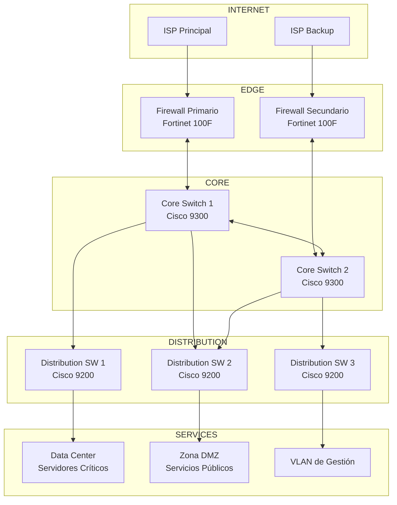
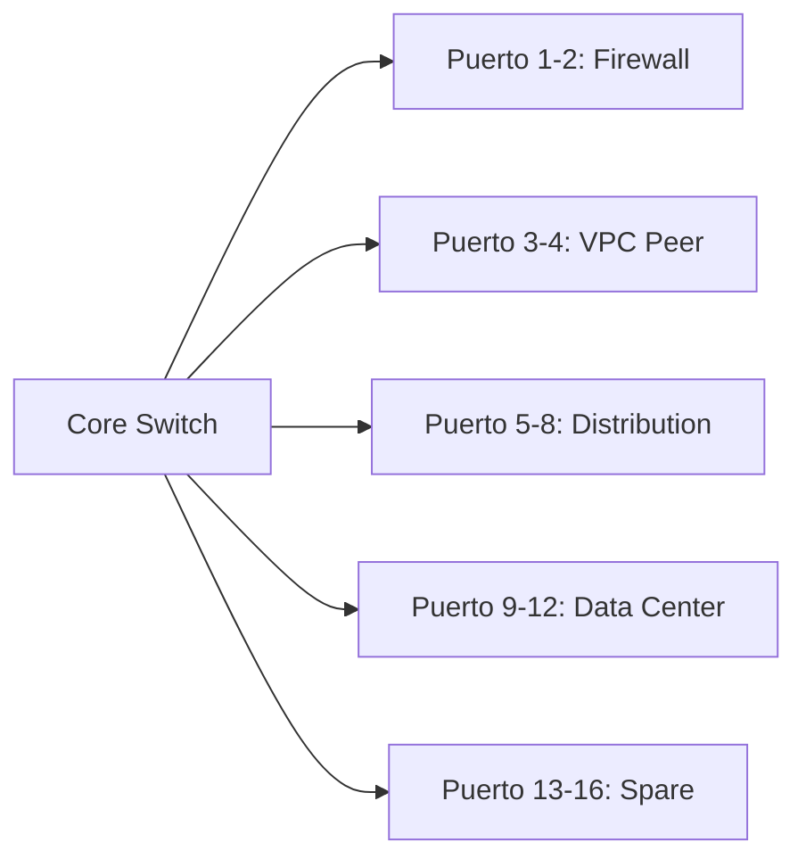
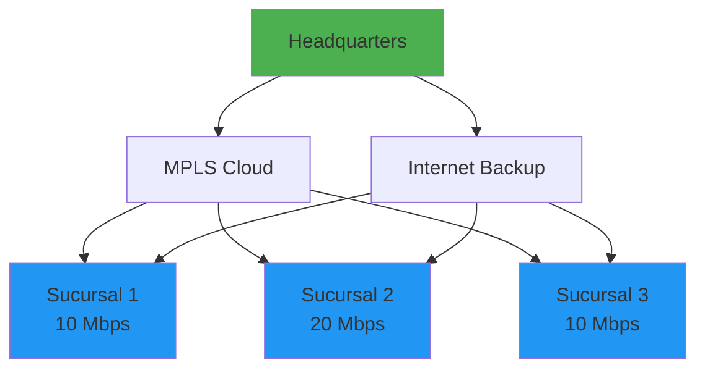
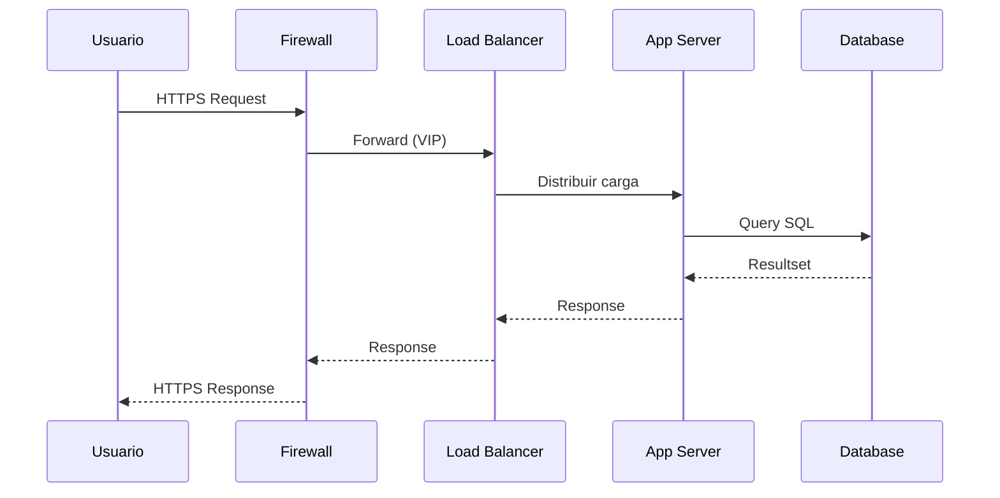

# Topología de Red Corporativa

## 📋 Descripción General

Este documento describe la topología de red de la organización, incluyendo diagramas, segmentación VLAN, y flujos de tráfico principales.

## 🏗️ Diagrama de Topología Principal



## 📊 Segmentación VLAN

### VLANs Corporativas

| VLAN ID | Nombre | Subnet | Propósito |
|---------|--------|--------|-----------|
| 10 | MGMT | 10.10.10.0/24 | Gestión de dispositivos |
| 20 | USERS | 10.10.20.0/23 | Usuarios generales |
| 30 | VOICE | 10.10.30.0/24 | Telefonía IP |
| 40 | GUEST | 10.10.40.0/24 | Invitados (isolated) |
| 50 | SERVERS | 10.10.50.0/24 | Servidores internos |
| 60 | DMZ | 10.10.60.0/26 | Servicios públicos |
| 70 | BACKUP | 10.10.70.0/28 | Tráfico de backup |
| 80 | IOT | 10.10.80.0/24 | Dispositivos IoT |
| 90 | DEV | 10.10.90.0/24 | Desarrollo/Testing |
| 100 | WAN_MPLS | 10.10.100.0/30 | Enlace MPLS sucursales |
| 101 | WAN_INET | 10.10.101.0/30 | Enlace Internet backup |

### Mapa de Puertos Core Switch



## 🔀 Protocolos de Routing

### Configuración OSPF

```
Area 0 (Backbone): Core + Distribution
Area 1: Data Center
Area 2: Sucursales (vía MPLS)

Router IDs:
- Core-1: 10.10.10.1
- Core-2: 10.10.10.2
- Dist-1: 10.10.10.11
- Dist-2: 10.10.10.12
```

### BGP (Sucursales)

```
AS Local: 65001
Vecinos BGP:
- Sucursal 1: 10.10.100.2 (AS 65002)
- Sucursal 2: 10.10.100.6 (AS 65003)
- Sucursal 3: 10.10.100.10 (AS 65004)
```

## 🔒 Políticas de Seguridad

### Matriz de Acceso entre VLANs

| Origen \ Destino | USERS | VOICE | SERVERS | DMZ | GUEST |
|-----------------|-------|-------|---------|-----|-------|
| **USERS** | ✓ | ✓ | Limitado | ✓ | ✗ |
| **VOICE** | ✗ | ✓ | ✗ | ✗ | ✗ |
| **SERVERS** | ✓ | ✓ | ✓ | ✓ | ✗ |
| **DMZ** | ✗ | ✗ | Limitado | ✓ | ✗ |
| **GUEST** | ✗ | ✗ | ✗ | ✗ | ✗ |
| **MGMT** | ✓ | ✓ | ✓ | ✓ | ✗ |

### Reglas de Firewall Principales

```
1. Permitir HTTP/HTTPS desde USERS hacia INTERNET
2. Permitir DNS (UDP 53) desde todas las VLANs internas
3. Permitir SMTP saliente solo desde mail servers
4. Bloquear todo tráfico GUEST → Interno
5. Permitir VPN (UDP 500, 4500) desde INTERNET → DMZ
6. Logging habilitado para todas las reglas de DENY
```

## 🌐 Conectividad WAN

### Enlaces Activos



### Tabla de Sitios Remotos

| Sitio | Tipo | Ancho de Banda | IP Pública | Contacto |
|-------|------|---------------|------------|----------|
| Sucursal 1 | MPLS + DSL | 10 Mbps + 50 Mbps | 200.x.x.1 | Juan Pérez |
| Sucursal 2 | MPLS + Fibra | 20 Mbps + 100 Mbps | 200.x.x.2 | María Gómez |
| Sucursal 3 | MPLS only | 10 Mbps | N/A | Carlos Ruiz |
| Data Center DR | Fibra dedicada | 1 Gbps | 200.x.x.10 | IT Operations |

## 📈 Capacidad y Utilización Actual

### Enlaces Principales

| Enlace | Capacidad | Utilización Promedio | Pico Máximo |
|--------|-----------|---------------------|-------------|
| Internet Primary | 500 Mbps | 45% | 78% |
| Internet Backup | 100 Mbps | 5% | 12% |
| MPLS Core | 1 Gbps | 35% | 55% |
| Data Center | 10 Gbps | 28% | 45% |

### Proyección de Crecimiento

```
Año actual: 65% de capacidad total utilizada
Proyección Año+1: 75% (recomendar upgrade en 18 meses)
Proyección Año+2: 88% (upgrade crítico requerido)
```

## 🔄 Flujos de Tráfico Críticos

### Aplicaciones Empresariales



### Backup Nocturno

```
Horario: 22:00 - 06:00
Ancho de banda reservado: 2 Gbps
Destino: Data Center de Disaster Recovery
Protocolo: NFS sobre iSCSI
Retención: 30 días online, 1 año archive
```

## 📝 Notas de Cambios Recientes

| Fecha | Cambio | Impacto | Responsable |
|-------|--------|---------|-------------|
| 2024-01-15 | Upgrade Core Switch | 0 downtime | Network Team |
| 2024-02-01 | Nueva VLAN IOT | Aislamiento dispositivos | Security Team |
| 2024-02-20 | Implementación SD-WAN | Mejora performance WAN | Network Senior |

## 🔗 Documentación Relacionada

- [Procedimiento de Configuración de VLANs](../procedures/configuracion-vlans.md)
- [Troubleshooting de Enlace WAN](../troubleshooting/fallo-enlace-wan.md)
- [Política de Seguridad de Red](link-a-politica)

---

**Última actualización:** $(date +%Y-%m-%d)  
**Autor:** Equipo de Arquitectura de Red  
**Versión del Diagrama:** 3.2  
**Próxima revisión:** Trimestral
