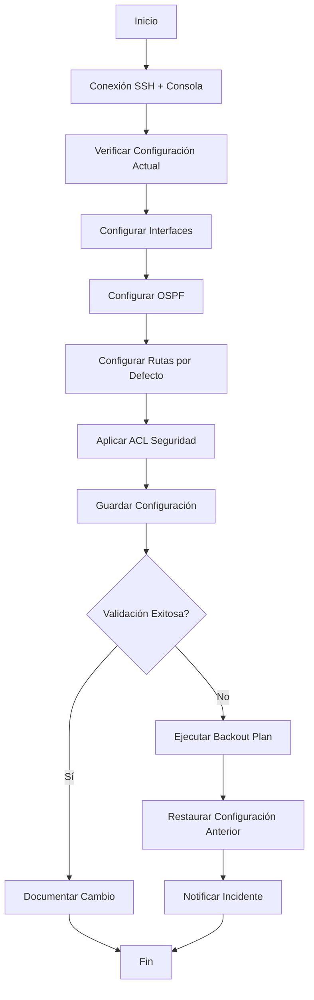

# Configuración del Router Core

## 📋 Propósito

Estandarizar la puesta en marcha del router core, el equipo más crítico de la red del Banco Tecnológico. Este procedimiento asegura consistencia en configuraciones de interfaces, protocolos de enrutamiento OSPF y validación posterior.

## ⚠️ Advertencias Previas

- **Nivel de Riesgo**: ALTO - Equipo crítico de la red
- **Ventana de Mantenimiento**: Requerida (fuera de horario bancario)
- **Personal Requerido**: Mínimo 2 administradores de red
- **Backout Plan**: Tener configuración anterior respaldada

## 📦 Prerrequisitos

- Acceso SSH al router con privilegios de administrador
- Archivo de configuración base aprobado
- Conexión consola física como respaldo
- Herramientas de monitoreo activas

## 🔧 Procedimiento Paso a Paso

### 1. Conexión Inicial

```bash
# Conexión SSH segura
ssh admin@router-core.banco.local

# Verificar versión actual
show version
show running-config
```

### 2. Configuración de Interfaces

```bash
configure terminal

! Interfaz hacia ISP Principal
interface GigabitEthernet0/0
 description ENLACE-ISP-PRINCIPAL-MPLS
 ip address 200.10.50.1 255.255.255.252
 duplex full
 speed 1000
 no shutdown
 exit

! Interfaz hacia ISP Secundario (Respaldo 4G)
interface GigabitEthernet0/1
 description ENLACE-ISP-RESPALDO-4G
 ip address 198.51.100.1 255.255.255.252
 duplex full
 speed 1000
 no shutdown
 exit

! Interfaz hacia LAN Core
interface GigabitEthernet0/2
 description CONEXION-LAN-CORE-SWITCH
 ip address 10.10.1.1 255.255.255.0
 duplex full
 speed 1000
 no shutdown
 exit
```

### 3. Configuración de OSPF

```bash
! Habilitar OSPF con ID de proceso 1
router ospf 1
 router-id 10.10.1.1
 
! Red LAN interna - Área 0
 network 10.10.1.0 0.0.0.255 area 0
 
! Red enlace principal - Área 0
 network 200.10.50.0 0.0.0.3 area 0
 
! Red enlace respaldo - Área 0 (costo mayor para backup)
 network 198.51.100.0 0.0.0.3 area 0
 
! Ajustar costos de interfaz
 interface GigabitEthernet0/0
  ip ospf cost 10
  exit
 interface GigabitEthernet0/1
  ip ospf cost 100
  exit
  
exit
```

### 4. Configuración de Rutas por Defecto

```bash
! Ruta primaria hacia ISP principal
ip route 0.0.0.0 0.0.0.0 200.10.50.2 10

! Ruta flotante hacia ISP secundario (administrative distance mayor)
ip route 0.0.0.0 0.0.0.0 198.51.100.2 200
```

### 5. Configuración de ACL de Seguridad

```bash
! ACL para filtrar tráfico entrante
access-list 101 permit tcp any host 200.10.50.1 established
access-list 101 permit icmp any host 200.10.50.1 echo-reply
access-list 101 deny ip any any log

! Aplicar ACL a interfaz externa
interface GigabitEthernet0/0
 ip access-group 101 in
 exit
```

### 6. Guardar Configuración

```bash
! Verificar cambios pendientes
show running-config

! Guardar configuración
write memory
copy running-config startup-config

! Crear respaldo con timestamp
copy running-config tftp://backup-server.banco.local/router-core-$(date +%Y%m%d).cfg
```

## ✅ Validación Posterior

### Verificación de Interfaces

```bash
show ip interface brief
show interfaces status
show interfaces counters errors
```

**Criterio de Éxito**: Todas las interfaces deben estar `up/up` sin errores.

### Verificación de Enrutamiento OSPF

```bash
show ip ospf neighbor
show ip ospf database
show ip route ospf
```

**Criterio de Éxito**: Vecinos OSPF en estado `FULL`, rutas aprendidas correctamente.

### Verificación de Conectividad

```bash
! Ping hacia ISP principal
ping 200.10.50.2 source GigabitEthernet0/0

! Ping hacia ISP secundario
ping 198.51.100.2 source GigabitEthernet0/1

! Ping hacia LAN interna
ping 10.10.1.100 source GigabitEthernet0/2

! Traceroute hacia internet
traceroute 8.8.8.8 source GigabitEthernet0/0
```

### Verificación de Failover

```bash
! Simular falla del enlace principal
interface GigabitEthernet0/0
 shutdown

! Verificar que el tráfico usa enlace secundario
show ip route 0.0.0.0

! Restaurar enlace principal
no shutdown
```

**Criterio de Éxito**: El failover ocurre en menos de 30 segundos.

## 📊 Diagrama de Flujo



## 🚨 Troubleshooting Común

| Problema | Causa Probable | Solución |
|----------|---------------|----------|
| Interfaz no levanta | Cableado defectuoso | Verificar cable y puerto del switch |
| Vecino OSPF no aparece | Mismatch de área o autenticación | Verificar configuración OSPF en ambos lados |
| Ruta por defecto no aparece | Administrative distance incorrecta | Revisar comando `ip route` |
| ACL bloquea tráfico legítimo | Reglas muy restrictivas | Revisar logs y ajustar ACL |

## 📝 Registro de Cambios

| Fecha | Versión | Autor | Descripción del Cambio |
|-------|---------|-------|----------------------|
| 2024-01-15 | 1.0 | Admin Senior | Configuración inicial |
| | | | |

## 🔗 Referencias

- Documentación oficial Cisco IOS
- Política de Seguridad Bancaria v3.2
- Matriz de Escalamiento: `/wiki/Contactos-y-Escalamiento.md`

---

**🏦 Banco Tecnológico - Departamento de TI**  
*Procedimiento validado y aprobado para producción*
