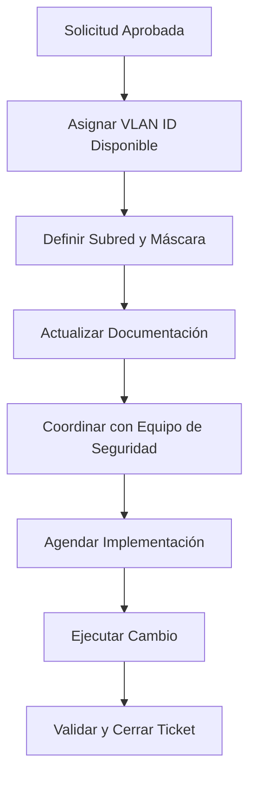
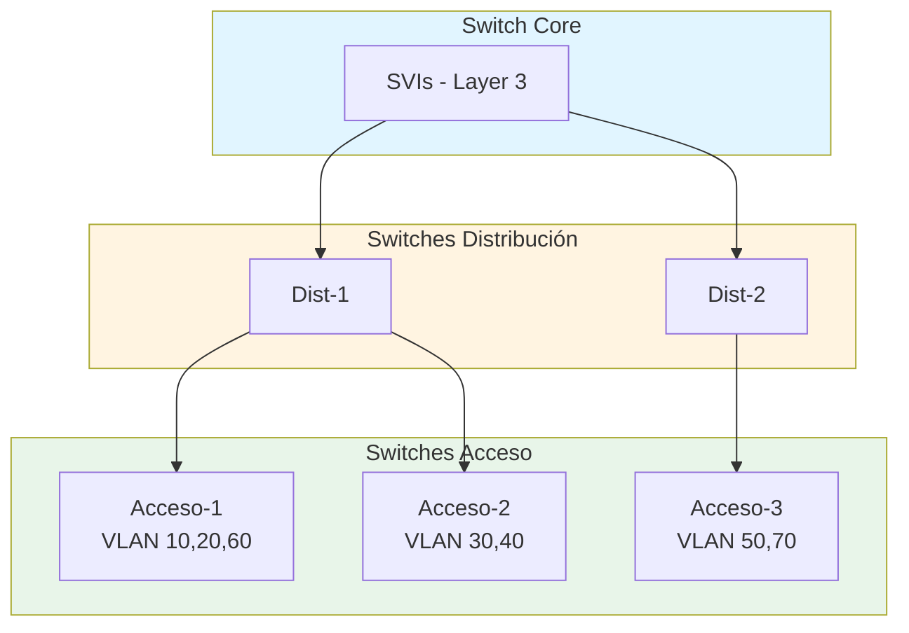

# Gestión de VLANs

## 📋 Propósito

Documentar el inventario de VLANs del Banco Tecnológico y establecer el procedimiento estándar para su creación, modificación y eliminación. Este procedimiento asegura consistencia, seguridad y trazabilidad en la segmentación de tráfico de red.

## 🎯 Alcance

- Todas las sucursales del Banco Tecnológico
- Switches de acceso, distribución y core
- Tráfico de datos, voz, servidores y dispositivos especiales

## 📊 Inventario de VLANs

### VLANs Corporativas Estándar

| VLAN ID | Nombre | Propósito | Subred | Estado |
|---------|--------|-----------|--------|--------|
| 10 | ADMINISTRACION | Personal administrativo | 10.10.10.0/24 | Activa |
| 20 | USUARIOS | Usuarios generales | 10.10.20.0/24 | Activa |
| 30 | CAJEROS | Terminales de cajero automático | 10.10.30.0/24 | Activa |
| 40 | SERVIDORES | Infraestructura de servidores | 10.10.40.0/24 | Activa |
| 50 | INVITADOS | Red para visitantes | 10.10.50.0/24 | Activa |
| 60 | VOZ | Telefonía IP | 10.10.60.0/24 | Activa |
| 70 | SEGURIDAD | Cámaras y sistemas de seguridad | 10.10.70.0/24 | Activa |
| 80 | IOT | Dispositivos IoT | 10.10.80.0/24 | Activa |
| 99 | MANAGEMENT | Gestión de equipos de red | 10.10.99.0/24 | Activa |

### VLANs por Sucursal (Ejemplo)

| Sucursal | VLAN ID | Nombre | Subred |
|----------|---------|--------|--------|
| Matriz | 110 | MATRIZ-USUARIOS | 10.11.10.0/24 |
| Mixco | 120 | MIXCO-USUARIOS | 10.12.10.0/24 |
| Zona 10 | 130 | ZONA10-USUARIOS | 10.13.10.0/24 |

## 🔧 Procedimiento de Creación de VLAN

### Paso 1: Solicitud y Aprobación

**Requisitos previos:**

- [ ] Ticket de cambio aprobado
- [ ] Justificación de negocio documentada
- [ ] Rango de IPs solicitado y aprobado
- [ ] Ventana de mantenimiento asignada (si aplica)

### Paso 2: Planificación



### Paso 3: Configuración en Switch Core

```bash
# Conectar al switch core
ssh admin@switch-core.banco.local

# Entrar en modo configuración
configure terminal

# Crear VLAN
vlan <ID_VLAN>
 name <NOMBRE_VLAN>
 exit

# Configurar interfaz SVI (Layer 3)
interface Vlan<ID_VLAN>
 description <DESCRIPCION>
 ip address <IP_GATEWAY> <MASCARA>
 ip helper-address <IP_SERVIDOR_DHCP>
 no shutdown
 exit

# Configurar ACL de seguridad (si aplica)
ip access-list extended ACL-VLAN<ID_VLAN>-IN
 permit ip <SUBRED_VLAN> 0.0.0.255 any
 deny ip any any log
 exit

# Aplicar ACL a la interfaz SVI
interface Vlan<ID_VLAN>
 ip access-group ACL-VLAN<ID_VLAN>-IN in
 exit

# Guardar configuración
write memory
```

### Paso 4: Configuración en Switches de Acceso

```bash
# Conectar a cada switch de acceso
ssh admin@switch-acceso-<ubicacion>.banco.local

configure terminal

# Crear VLAN en el switch
vlan <ID_VLAN>
 name <NOMBRE_VLAN>
 exit

# Configurar puertos de acceso
interface range GigabitEthernet1/0/<puertos>
 description <DESCRIPCION>
 switchport mode access
 switchport access vlan <ID_VLAN>
 spanning-tree portfast
 spanning-tree bpduguard enable
 no shutdown
 exit

# Configurar trunk hacia distribución/core
interface GigabitEthernet1/0/48
 description UPLINK-CORE
 switchport mode trunk
 switchport trunk allowed vlan add <ID_VLAN>
 exit

# Guardar configuración
write memory
```

### Paso 5: Configuración de DHCP

```bash
# En el servidor DHCP o router
ip dhcp pool VLAN_<ID_VLAN>
 network <SUBRED> <MASCARA>
 default-router <IP_GATEWAY>
 dns-server <DNS_PRIMARIO> <DNS_SECUNDARIO>
 lease 7
 exit

# Excluir direcciones estáticas
ip dhcp excluded-address <IP_INICIO> <IP_FIN>
```

### Paso 6: Actualizar Firewall

```bash
# En firewall perimetral
# Agregar reglas de seguridad para la nueva VLAN
# Definir políticas de acceso a internet/recursos
```

## ✅ Validación Posterior

### Verificación en Switch Core

```bash
# Verificar que la VLAN existe
show vlan id <ID_VLAN>

# Verificar interfaz SVI
show interface Vlan<ID_VLAN>
show ip interface brief | include Vlan<ID_VLAN>

# Verificar enrutamiento
show ip route <SUBRED_VLAN>

# Verificar conectividad
ping <IP_DISPOSITIVO_EN_VLAN> source Vlan<ID_VLAN>
```

### Verificación en Switches de Acceso

```bash
# Verificar VLAN en todos los switches
show vlan id <ID_VLAN>

# Verificar puertos configurados
show interfaces status | include <ID_VLAN>

# Verificar trunk
show interfaces trunk | include <ID_VLAN>
```

### Pruebas de Conectividad

```bash
# Desde un dispositivo en la nueva VLAN
ping <GATEWAY>
ping <DNS_SERVER>
ping <INTERNET_8.8.8.8>

# Verificar obtención de IP
ipconfig /all  # Windows
ifconfig       # Linux/Mac

# Verificar acceso a recursos autorizados
# (según políticas de seguridad definidas)
```

## 🔒 Consideraciones de Seguridad

### Segmentación Obligatoria

| Tipo de Tráfico | VLAN Requerida | Aislamiento |
|-----------------|----------------|-------------|
| Cajeros Automáticos | 30 | Aislado total excepto servidores autorizados |
| Servidores Críticos | 40 | Solo accesos autorizados por firewall |
| Invitados | 50 | Solo salida a internet, sin acceso interno |
| Management | 99 | Acceso solo desde IPs administrativas |

### ACLs Mínimas Requeridas

```bash
! Ejemplo: VLAN de Cajeros - Solo comunicación con servidores específicos
ip access-list extended ACL-CAJEROS-IN
 permit tcp 10.10.30.0 0.0.0.255 host 10.10.40.10 eq 443
 permit tcp 10.10.30.0 0.0.0.255 host 10.10.40.11 eq 443
 deny ip 10.10.30.0 0.0.0.255 any log
 permit ip any any
```

## 📝 Procedimiento de Modificación

### Cambiar Nombre de VLAN

```bash
configure terminal
vlan <ID_VLAN>
 name <NUEVO_NOMBRE>
 exit
write memory
```

### Cambiar Subred de VLAN

**⚠️ ADVERTENCIA**: Este cambio requiere ventana de mantenimiento y afecta a todos los usuarios.

1. Notificar a usuarios afectados
2. Actualizar scope DHCP
3. Cambiar IP de interfaz SVI
4. Actualizar ACLs si aplica
5. Forzar renew DHCP en clientes
6. Validar conectividad

### Agregar Puertos a VLAN

```bash
configure terminal
interface range <PUERTOS>
 switchport access vlan <ID_VLAN>
 exit
write memory
```

## 🗑️ Procedimiento de Eliminación

### Preconditions

- [ ] Confirmar que la VLAN no está en uso
- [ ] Migrar dispositivos a otra VLAN (si aplica)
- [ ] Eliminar entradas DHCP asociadas
- [ ] Actualizar documentación y firewall

### Pasos de Eliminación

```bash
# Remover VLAN de trunks
interface <TRUNK_INTERFACES>
 switchport trunk allowed vlan remove <ID_VLAN>
 exit

# Eliminar interfaz SVI
no interface Vlan<ID_VLAN>

# Eliminar VLAN
no vlan <ID_VLAN>

# Eliminar ACLs asociadas
no ip access-list extended <ACL_NAME>

# Guardar cambios
write memory
```

## 📊 Diagrama de Segmentación



## 🚨 Troubleshooting

| Problema | Causa Probable | Solución |
|----------|---------------|----------|
| Dispositivos no obtienen IP | DHCP no alcanzable | Verificar `ip helper-address` |
| Sin conectividad entre VLANs | Enrutamiento no configurado | Verificar SVI y rutas |
| Puerto no acepta VLAN | VLAN no existe en switch | Crear VLAN primero |
| Tráfico no pasa por trunk | VLAN no permitida en trunk | Agregar VLAN al trunk |
| ACL bloquea tráfico legítimo | Reglas incorrectas | Revisar y ajustar ACL |

## 📋 Checklist de Implementación

### Pre-Implementación

- [ ] Ticket de cambio aprobado
- [ ] VLAN ID disponible verificado
- [ ] Subred asignada y documentada
- [ ] ACLs diseñadas y revisadas
- [ ] Ventana de mantenimiento coordinada

### Durante Implementación

- [ ] Backup de configuraciones realizado
- [ ] VLAN creada en core
- [ ] SVI configurado y activo
- [ ] VLAN propagada a switches de acceso
- [ ] Puertos configurados correctamente
- [ ] DHCP funcionando

### Post-Implementación

- [ ] Pruebas de conectividad exitosas
- [ ] Documentación actualizada
- [ ] Firewall actualizado
- [ ] Ticket cerrado con evidencia
- [ ] Lecciones aprendidas documentadas

## 📝 Registro de Cambios

| Fecha | VLAN ID | Acción | Autor | Descripción |
|-------|---------|--------|-------|-------------|
| 2024-01-15 | 10-99 | Creación | Admin Senior | VLANs corporativas iniciales |
| | | | | |

## 🔗 Referencias

- Política de Seguridad de Red
- Estándar de Nomenclatura
- Matriz de Escalamiento: `/wiki/Contactos-y-Escalamiento.md`
- Inventario de Dispositivos

---

**🏦 Banco Tecnológico - Departamento de TI**  
*Procedimiento validado y aprobado para producción*
