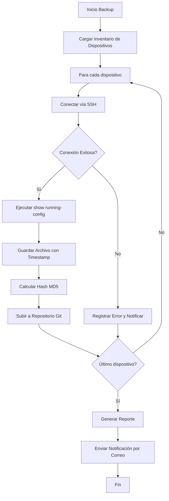

# Respaldo de Configuraciones

## 📋 Propósito

Definir la política de respaldo de configuraciones de todos los dispositivos de red del Banco Tecnológico. Este procedimiento garantiza la recuperación ante fallos, cambios erróneos o desastres.

## 🎯 Alcance

- Routers (Core, Distribución, Acceso)
- Switches (Core, Distribución, Acceso)
- Firewalls Perimetrales e Internos
- Balanceadores de Carga

## 📅 Política de Respaldo

### Respaldo Automatizado (Diario)

| Tipo | Frecuencia | Retención | Ubicación |
|------|------------|-----------|-----------|
| Automático | Diario 02:00 AM | 30 días | Servidor backup interno |
| Automático | Semanal (Domingo) | 90 días | Servidor backup interno + Nube |
| Automático | Mensual (Día 1) | 1 año | Servidor backup interno + Nube + Offline |

### Respaldo Manual (Obligatorio)

**ANTES DE CUALQUIER CAMBIO EN PRODUCCIÓN**

1. Realizar respaldo manual del dispositivo afectado
2. Verificar integridad del archivo respaldado
3. Documentar el cambio en el sistema de tickets
4. Proceder con el cambio planificado

## 🔧 Procedimiento de Respaldo Automatizado

### Script Principal: `backup_configs.sh`

El script se encuentra en `/docs/scripts/backup_configs.sh` y debe ejecutarse vía cron:

```bash
# Agregar al crontab del usuario backup
0 2 * * * /opt/banco/scripts/backup_configs.sh >> /var/log/backup_configs.log 2>&1
```

### Flujo del Script



### Estructura de Directorios de Respaldo

```
/backup/router-configs/
├── router-core/
│   ├── 2024/
│   │   ├── 01/
│   │   │   ├── router-core-20240115.cfg
│   │   │   └── router-core-20240115.md5
│   │   └── ...
│   └── latest.cfg -> 2024/01/router-core-20240115.cfg
├── switch-core/
├── firewall-perimetral/
└── manifest.json
```

## 📝 Procedimiento de Respaldo Manual

### Paso 1: Conexión al Dispositivo

```bash
# Para dispositivos Cisco IOS
ssh admin@<ip-del-dispositivo>

# Para firewalls Palo Alto
ssh admin@<ip-del-firewall>
```

### Paso 2: Ejecutar Respaldo

#### Cisco IOS/NX-OS

```bash
# Mostrar configuración actual
show running-config

# Copiar a terminal y guardar
show running-config | tee flash:/backup-$(date +%Y%m%d-%H%M).cfg

# Copiar a servidor TFTP/SCP
copy running-config scp://user@backup-server/banco/dispositivo-fecha.cfg
```

#### Palo Alto Firewall

```bash
# Exportar configuración
export configuration to "backup-$(date +%Y%m%d).xml"

# Copiar a servidor externo
scp export configuration from "backup-$(date +%Y%m%d).xml" to user@backup-server:/path/
```

#### HP ProCurve/Aruba

```bash
# Mostrar configuración
show running-config

# Copiar a TFTP
copy running-config tftp <ip-servidor> <nombre-archivo>.cfg
```

### Paso 3: Verificar Integridad

```bash
# Calcular hash del archivo respaldado
md5sum dispositivo-fecha.cfg > dispositivo-fecha.md5

# Verificar que el archivo no esté vacío o corrupto
wc -l dispositivo-fecha.cfg
# Debe tener más de 50 líneas para configuraciones típicas

# Comparar con respaldo anterior (diff)
diff dispositivo-fecha.cfg dispositivo-anterior.cfg
```

### Paso 4: Documentar en Sistema de Tickets

Crear entrada con:

- Número de ticket/cambio
- Dispositivo respaldado
- Fecha y hora del respaldo
- Ubicación del archivo
- Hash de verificación
- Autor del respaldo

## 🔄 Procedimiento de Restauración

### Escenario 1: Restauración Completa

```bash
# Copiar configuración al dispositivo
copy scp://user@backup-server/banco/dispositivo-fecha.cfg running-config

# O desde TFTP
copy tftp://backup-server/dispositivo-fecha.cfg running-config

# Verificar sin aplicar
configure replace nvram:startup-config list force

# Aplicar si todo está correcto
write memory
reload
```

### Escenario 2: Restauración Parcial (Comandos Específicos)

1. Abrir archivo de respaldo en editor
2. Identificar sección a restaurar
3. Copiar comandos específicos
4. Pegar en sesión de configuración
5. Verificar funcionamiento
6. Guardar cambios

### Escenario 3: Recovery de Desastre

```bash
# Conectar vía consola física
# Boot en modo ROMMON
rommon 1 > set IP_ADDRESS=10.10.1.1
rommon 2 > set IP_SUBNET_MASK=255.255.255.0
rommon 3 > set DEFAULT_GATEWAY=10.10.1.254
rommon 4 > set TFTP_SERVER=10.10.1.100
rommon 5 > set TFTP_FILE=router-core-recovery.cfg
rommon 6 > tftpdnld

# El dispositivo cargará la configuración desde TFTP
```

## 📊 Monitoreo y Alertas

### Métricas a Monitorear

| Métrica | Umbral | Acción |
|---------|--------|--------|
| Backups fallidos | > 0 | Alerta inmediata |
| Tamaño inusual | ±30% vs promedio | Revisión manual |
| Tiempo de backup | > 30 min por dispositivo | Investigar |
| Espacio disponible | < 20% | Limpieza o expansión |

### Notificaciones por Correo

El script envía reporte diario con:

- ✅ Dispositivos respaldados exitosamente
- ❌ Dispositivos con error
- ⚠️ Advertencias (tamaño inusual, tiempo excesivo)
- 📈 Estadísticas semanales/mensuales

## 🔐 Seguridad del Respaldo

### Encriptación

```bash
# Encriptar archivos sensibles antes de almacenar
openssl enc -aes-256-cbc -salt -in config.cfg -out config.cfg.enc -k <clave>

# Para desencriptar
openssl enc -aes-256-cbc -d -in config.cfg.enc -out config.cfg -k <clave>
```

### Control de Acceso

- Solo personal autorizado puede acceder a backups
- Autenticación de dos factores para servidor de backups
- Logs de acceso auditables
- Rotación de credenciales cada 90 días

### Almacenamiento Seguro

- Servidor interno en VLAN aislada
- Réplica en nube con encriptación
- Copia offline mensual en ubicación física segura

## 📋 Checklist de Verificación

### Diario (Automático)

- [ ] Script se ejecutó a las 02:00 AM
- [ ] Todos los dispositivos fueron respaldados
- [ ] No hay errores en el log
- [ ] Correo de notificación recibido
- [ ] Espacio en disco suficiente

### Semanal (Manual)

- [ ] Verificar integridad de backups aleatorios
- [ ] Prueba de restauración en laboratorio
- [ ] Revisar políticas de retención
- [ ] Actualizar inventario de dispositivos

### Mensual (Auditoría)

- [ ] Auditoría completa de backups
- [ ] Prueba de recovery de desastre
- [ ] Revisión de accesos y permisos
- [ ] Actualización de documentación

## 🚨 Troubleshooting

| Problema | Causa Probable | Solución |
|----------|---------------|----------|
| Backup falla por timeout | Dispositivo no responde | Verificar conectividad y credenciales |
| Archivo vacío o corrupto | Error en transferencia | Reintentar y verificar espacio en disco |
| Error de autenticación | Credenciales expiradas | Actualizar en inventario y vault |
| Espacio insuficiente | Retención no aplicada | Ejecutar limpieza de archivos antiguos |

## 📝 Registro de Cambios

| Fecha | Versión | Autor | Descripción del Cambio |
|-------|---------|-------|----------------------|
| 2024-01-15 | 1.0 | Admin Senior | Política inicial de backups |
| | | | |

## 🔗 Referencias

- Script: `/docs/scripts/backup_configs.sh`
- Inventario: `/docs/inventario-dispositivos.md`
- Política de Seguridad: `/wiki/Politicas-Seguridad.md`
- Contactos de Emergencia: `/wiki/Contactos-y-Escalamiento.md`

---

**🏦 Banco Tecnológico - Departamento de TI**  
*Procedimiento validado y aprobado para producción*
