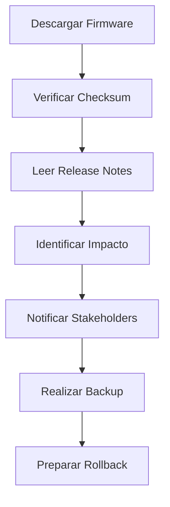

# Actualización de Firmware en Switches y Firewalls

## 📋 Descripción

Procedimiento seguro para aplicar parches y actualizaciones de firmware en dispositivos de red (Switches y Firewalls) minimizando el impacto en la operación.

## ⚠️ Pre-requisitos

- Ventana de mantenimiento aprobada
- Backup completo de la configuración actual
- Archivo de firmware verificado (checksum MD5/SHA256)
- Plan de rollback documentado
- Notificación a usuarios afectados
- Consola física o acceso out-of-band disponible

## 🎯 Objetivo

Mantener los dispositivos de red actualizados para:
- Corregir vulnerabilidades de seguridad
- Mejorar estabilidad y rendimiento
- Obtener nuevas funcionalidades
- Cumplir con políticas de compliance

## 📝 Pasos de Implementación

### 1. Preparación (Pre-Ventana)



### 2. Verificación del Firmware

```bash
# Verificar checksum del archivo descargado
md5sum firmware_image.bin
sha256sum firmware_image.bin

# Comparar con el checksum publicado por el fabricante
# Deben coincidir exactamente
```

### 3. Backup de Configuración

```bash
# En dispositivo Cisco
copy running-config tftp://<SERVER_IP>/<HOSTNAME>_running_<DATE>.cfg
copy startup-config tftp://<SERVER_IP>/<HOSTNAME>_startup_<DATE>.cfg

# Backup completo via SCP
scp admin@<DEVICE_IP>:flash:/config.text backup_location/
```

### 4. Proceso de Actualización - Switches Cisco

```bash
# Copiar imagen al dispositivo
copy tftp://<TFTP_SERVER_IP>/firmware_image.bin flash:

# Verificar integridad
verify /md5 flash:firmware_image.bin <CHECKSUM_ESPERADO>

# Configurar boot system
configure terminal
boot system flash:firmware_image.bin
exit

# Guardar configuración
write memory

# Reiniciar el switch
reload

# Confirmar versión después del reinicio
show version
```

### 5. Proceso de Actualización - Firewalls Palo Alto

```bash
# Subir imagen vía web UI o CLI
> request system software download file <IMAGE_FILE> from <URL>

# Verificar descarga
> show system software

# Instalar actualización
> request system software install version <VERSION_NUMBER>

# El firewall se reiniciará automáticamente
# Verificar estado post-reinicio
> show system info
```

### 6. Proceso de Actualización - Firewalls Fortinet

```bash
# Subir firmware
execute restore image tftp <IMAGE_FILE> <TFTP_SERVER_IP>

# Confirmar actualización
y

# El equipo se reiniciará
# Verificar después del reboot
get system status
```

## ✅ Verificación Post-Actualización

### Checklist de Verificación

```bash
# 1. Verificar versión de firmware
show version

# 2. Verificar estado de interfaces
show ip interface brief
show interfaces status

# 3. Verificar protocolos de routing
show ip protocols
show ip route summary

# 4. Verificar redundancia (si aplica)
show standby
show vrrp

# 5. Verificar logs de errores
show logging | include ERROR|CRITICAL|FAIL

# 6. Verificar conectividad end-to-end
ping <DESTINOS_CRITICOS>
traceroute <DESTINOS_CRITICOS>

# 7. Verificar servicios críticos
show processes cpu | exclude 0.00
show memory statistics
```

### Lista de Verificación

- [ ] Firmware versión correcta confirmada
- [ ] Todas las interfaces up/up
- [ ] Protocolos de routing operativos
- [ ] Sesiones de redundancia establecidas
- [ ] No hay errores críticos en logs
- [ ] Conectividad verificada
- [ ] Servicios críticos funcionando
- [ ] Usuarios pueden operar normalmente

## 🔙 Rollback

### Procedimiento de Rollback - Switches

```bash
# Acceder vía consola si es necesario
# Interrumpir boot sequence si el nuevo firmware falla

# Cambiar boot variable a imagen anterior
configure terminal
no boot system
boot system flash:<IMAGEN_ANTERIOR.bin>
exit
write memory
reload
```

### Procedimiento de Rollback - Firewalls

```bash
# Palo Alto: Mantener partición con versión anterior
> request system software downgrade

# Fortinet: Usar imagen de backup desde modo recovery
# Seguir procedimiento específico del modelo
```

## 🚨 Consideraciones de Seguridad

1. **Nunca actualizar durante horario productivo** sin aprobación ejecutiva
2. **Siempre tener acceso out-of-band** antes de comenzar
3. **Verificar compatibilidad** de configuración con nueva versión
4. **Revisar release notes** para cambios breaking
5. **Documentar todo** el proceso y resultados

## 📞 Escalamiento

| Nivel | Contacto | Situación |
|-------|----------|-----------|
| 1 | Network Admin | Actualización rutinaria |
| 2 | Network Senior | Problemas post-actualización |
| 3 | Vendor TAC | Bugs críticos o fallos de hardware |
| 4 | Management | Impacto prolongado al negocio |

## 📄 Referencias

- [Release Notes del Fabricante](link-a-release-notes)
- [Matriz de Compatibilidad](link-a-matriz)
- [Política de Gestión de Cambios](link-a-politica)
- TAC Case: _____

---

**Última actualización:** $(date +%Y-%m-%d)  
**Autor:** Equipo de Redes  
**Revisión:** 1.0  
**Próxima revisión programada:** Trimestral
