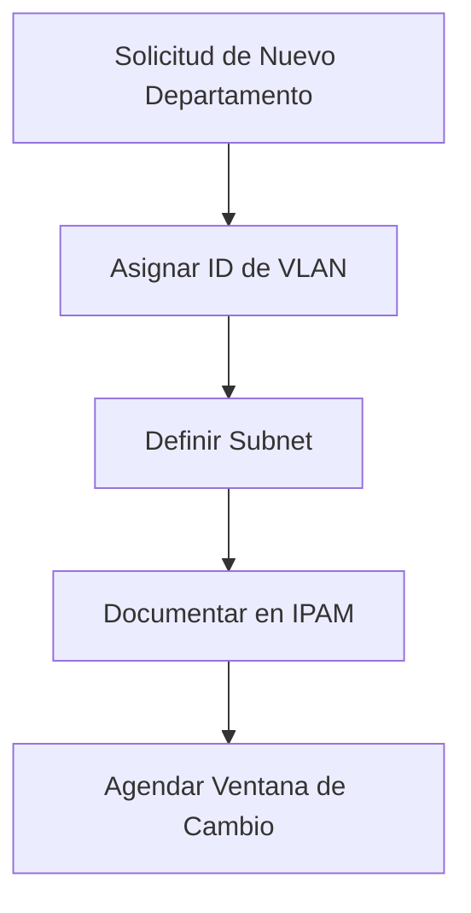

# Configuración de VLANs para Nuevos Departamentos

## 📋 Descripción

Este documento describe el procedimiento estándar para configurar VLANs cuando se incorpora un nuevo departamento a la red corporativa.

## ⚠️ Pre-requisitos

- Acceso administrativo a los switches
- Información del departamento (número de usuarios, ubicación)
- Rango de IPs asignado por el equipo de direccionamiento
- Aprobación del cambio según política de cambios

## 🎯 Objetivo

Segmentar el tráfico del nuevo departamento para:
- Mejorar la seguridad de red
- Facilitar la aplicación de políticas QoS
- Aislar broadcast domains
- Cumplir con requisitos de compliance

## 📝 Pasos de Implementación

### 1. Planificación



### 2. Configuración en Switch Core

```bash
# Acceder al switch
ssh admin@switch-core.company.local

# Entrar en modo configuración
configure terminal

# Crear la VLAN
vlan <VLAN_ID>
name DEPTO_<NOMBRE>
exit

# Configurar interfaz SVI para routing
interface vlan <VLAN_ID>
description VLAN_DEPTO_<NOMBRE>
ip address <IP_GATEWAY> <SUBNET_MASK>
no shutdown
exit

# Guardar configuración
write memory
```

### 3. Configuración en Switches de Acceso

```bash
# Configurar puertos para el nuevo departamento
interface range gigabitEthernet 1/0/<PUERTO_INICIAL> - <PUERTO_FINAL>
description DEPTO_<NOMBRE>
switchport mode access
switchport access vlan <VLAN_ID>
spanning-tree portfast
no shutdown
exit

# Configurar trunk hacia el core (si aplica)
interface gigabitEthernet 1/0/<PUERTO_TRUNK>
description UPLINK_TO_CORE
switchport mode trunk
switchport trunk allowed vlan add <VLAN_ID>
exit

write memory
```

### 4. Configuración en Firewall

```bash
# Crear objeto de red para la nueva VLAN
object network OBJ_DEPTO_<NOMBRE>
subnet <SUBNET> <MASK>

# Crear reglas de acceso
access-list DEPTO_<NOMBRE>_IN extended permit ip object OBJ_DEPTO_<NOMBRE> any
access-list DEPTO_<NOMBRE>_OUT extended permit ip any object OBJ_DEPTO_<NOMBRE>

# Aplicar a interfaz
access-group DEPTO_<NOMBRE>_IN in interface inside
access-group DEPTO_<NOMBRE>_OUT out interface inside
```

### 5. Configuración DHCP (si aplica)

```bash
# En servidor DHCP o switch layer3
ip dhcp pool DEPTO_<NOMBRE>
network <SUBNET> <MASK>
default-router <GATEWAY_IP>
dns-server <DNS_PRIMARY> <DNS_SECONDARY>
lease 7
exit
```

## ✅ Verificación

### Comandos de Verificación

```bash
# Verificar VLAN creada
show vlan id <VLAN_ID>

# Verificar interfaz SVI
show ip interface brief | include Vlan<VLAN_ID>

# Verificar conectividad
ping <IP_DISPOSITIVO_EN_VLAN>

# Verificar DHCP
show ip dhcp binding | include <SUBNET>

# Verificar trunk
show interfaces trunk | include <VLAN_ID>
```

### Checklist de Verificación

- [ ] VLAN aparece en `show vlan`
- [ ] Interfaz SVI está up/up
- [ ] Dispositivos obtienen IP vía DHCP
- [ ] Hay conectividad desde y hacia la VLAN
- [ ] Reglas de firewall aplicadas correctamente
- [ ] Documentación actualizada en IPAM

## 🔙 Rollback

En caso de problemas, ejecutar:

```bash
# Eliminar VLAN de trunks
interface <TRUNK_INTERFACE>
switchport trunk allowed vlan remove <VLAN_ID>
exit

# Eliminar interfaz SVI
no interface vlan <VLAN_ID>

# Eliminar VLAN
no vlan <VLAN_ID>

write memory
```

## 📞 Escalamiento

| Nivel | Contacto | Situación |
|-------|----------|-----------|
| 1 | Helpdesk | Usuarios sin conectividad |
| 2 | Network Admin | Problemas de configuración |
| 3 | Network Senior | Fallos críticos o no resueltos |

## 📄 Referencias

- [Política de Cambios de Red](link-a-politica)
- [Estándar de Direccionamiento IP](link-a-estandar)
- Documentación del fabricante del switch

---

**Última actualización:** $(date +%Y-%m-%d)  
**Autor:** Equipo de Redes  
**Revisión:** 1.0
