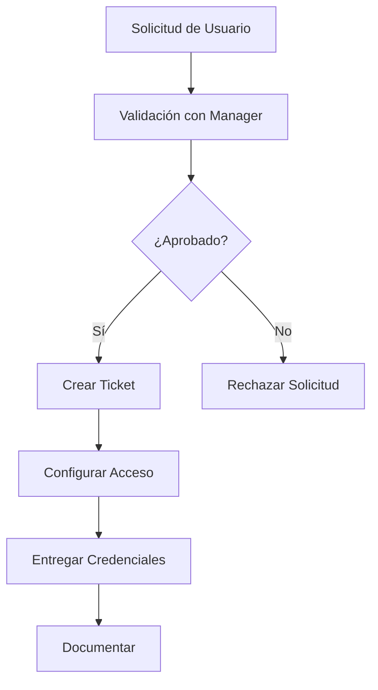

# Gestión de VPN - Alta de Accesos Remotos Seguros

## 📋 Descripción

Procedimiento para configurar y gestionar accesos VPN remotos seguros para usuarios, contratistas y sucursales.

## ⚠️ Pre-requisitos

- Solicitud aprobada por el responsable del área
- Usuario creado en Active Directory / LDAP
- Certificado digital válido (si aplica)
- Cliente VPN instalado en el equipo del usuario
- Política de seguridad firmada por el usuario

## 🎯 Objetivo

Proporcionar acceso remoto seguro a los recursos corporativos mediante túneles cifrados, manteniendo la confidencialidad e integridad de los datos.

## 📝 Tipos de VPN Soportados

| Tipo | Uso | Autenticación |
|------|-----|---------------|
| SSL VPN | Usuarios remotos | AD + MFA |
| IPsec Site-to-Site | Sucursales | Certificados + PSK |
| Always-On VPN | Equipos corporativos | Certificado de máquina |

## 📝 Pasos de Implementación

### 1. Solicitud y Aprobación



### 2. Configuración en Firewall - Cisco ASA/FTD

```bash
# Crear grupo de túnel
configure terminal
tunnel-group <GROUP_NAME> type remote-access
tunnel-group <GROUP_NAME> general-attributes
address-pool <POOL_VPN>
default-group-policy <POLICY_NAME>
exit

# Configurar autenticación
tunnel-group <GROUP_NAME> webvpn-attributes
authentication aaa
exit

# Crear política de grupo
group-policy <POLICY_NAME> internal
group-policy <POLICY_NAME> attributes
vpn-tunnel-protocol ssl-client
split-tunnel-policy tunnelspecified
split-tunnel-network-list value <SPLIT_TUNNEL_ACL>
dns-server value <DNS_PRIMARY> <DNS_SECONDARY>
exit

# Configurar lista de redes para split-tunnel
access-list <SPLIT_TUNNEL_ACL> standard permit <REDES_CORPORATIVAS>
```

### 3. Configuración en Firewall - Palo Alto

```bash
# Crear agente de autenticación
set network authentication-profile <AUTH_PROFILE>
set network authentication-profile <AUTH_PROFILE> allow-list LOCAL

# Configurar portal GlobalProtect
set global-protect portal <PORTAL_NAME>
set global-protect portal <PORTAL_NAME> authentication-profile <AUTH_PROFILE>
set global-protect portal <PORTAL_NAME> client-config app <APP_VERSION>

# Configurar gateway
set global-protect gateway <GATEWAY_NAME>
set global-protect gateway <GATEWAY_NAME> authentication-profile <AUTH_PROFILE>
set global-protect gateway <GATEWAY_NAME> client-config tunnel-mode tunnel-all
```

### 4. Configuración en Firewall - Fortinet

```bash
config user local
    edit "<USERNAME>"
        set type password
        set passwd <PASSWORD>
        set two-factor fortitoken
        set fortitoken <TOKEN_SERIAL>
    next
end

config vpn ssl settings
    set servercert <CERTIFICATE_NAME>
    set port 443
end

config vpn ssl web portal
    edit "<PORTAL_NAME>"
        set login-page customized
        set tunnel-mode enable
    next
end
```

### 5. Creación de Usuario en Active Directory

```powershell
# PowerShell - Crear usuario para VPN
Import-Module ActiveDirectory

New-ADUser `
    -Name "<NOMBRE_COMPLETO>" `
    -GivenName "<NOMBRE>" `
    -Surname "<APELLIDO>" `
    -SamAccountName "<USERNAME>" `
    -UserPrincipalName "<USERNAME>@domain.local" `
    -Path "OU=VPN Users,DC=domain,DC=local" `
    -AccountPassword (ConvertTo-SecureString "<PASSWORD>" -AsPlainText -Force) `
    -Enabled $true `
    -ChangePasswordAtLogon $false

# Agregar a grupo de VPN
Add-ADGroupMember -Identity "VPN_Users" -Members "<USERNAME>"
```

### 6. Generación de Certificado (si aplica)

```bash
# En OpenSSL
openssl genrsa -out <username>.key 2048
openssl req -new -key <username>.key -out <username>.csr
openssl x509 -req -days 365 -in <username>.csr \
    -CA ca.crt -CAkey ca.key -set_serial <SERIAL> \
    -out <username>.crt

# Convertir a PKCS12 para importar en cliente
openssl pkcs12 -export -out <username>.p12 \
    -inkey <username>.key -in <username>.crt -certfile ca.crt
```

## ✅ Verificación

### Comandos de Verificación

```bash
# Cisco ASA - Verificar sesiones activas
show vpn-sessiondb anyconnect

# Palo Alto - Verificar usuarios conectados
show global-protect gateway network-usage

# Fortinet - Verificar túneles SSL
get vpn ssl monitor

# Verificar logs de autenticación
show logging | include VPN|AnyConnect|GlobalProtect
```

### Checklist de Verificación

- [ ] Usuario puede autenticarse correctamente
- [ ] Túnel se establece sin errores
- [ ] Usuario recibe IP del pool correcto
- [ ] DNS resuelve nombres internos
- [ ] Acceso a recursos autorizados funciona
- [ ] No hay acceso a redes no autorizadas
- [ ] Logs registran la conexión correctamente

## 🔧 Configuración del Cliente

### Windows - Cisco AnyConnect

1. Abrir Cisco AnyConnect Secure Mobility Client
2. Ingresar dirección del VPN Gateway: `vpn.company.com`
3. Click en **Connect**
4. Ingresar credenciales de dominio
5. Aceptar certificado si es la primera vez
6. Verificar icono de conexión establecida

### macOS / Linux - OpenConnect

```bash
# Instalar cliente
sudo apt install openconnect  # Debian/Ubuntu
sudo dnf install openconnect  # RHEL/Fedora

# Conectar
sudo openconnect vpn.company.com --user=<USERNAME>

# O con certificado
sudo openconnect vpn.company.com \
    --certificate=<username>.p12 \
    --sslkey=password
```

## 🔙 Revocación de Acceso

### Procedimiento de Baja

```bash
# 1. Deshabilitar usuario en AD
Disable-ADAccount -Identity "<USERNAME>"

# 2. Eliminar de grupos de VPN
Remove-ADGroupMember -Identity "VPN_Users" -Members "<USERNAME>"

# 3. Eliminar configuración local en firewall
# Cisco ASA
no username <USERNAME>

# 4. Revocar certificado (si aplica)
openssl ca -revoke <username>.crt

# 5. Documentar baja en ticket
```

## 🚨 Consideraciones de Seguridad

1. **MFA obligatorio** para todos los accesos VPN
2. **Split-tunneling** solo para redes corporativas específicas
3. **Política de timeout**: desconexión después de 8 horas
4. **Revisión trimestral** de usuarios activos
5. **Bloqueo automático** después de 3 intentos fallidos
6. **Logs centralizados** en SIEM para auditoría

## 📞 Escalamiento

| Nivel | Contacto | Situación |
|-------|----------|-----------|
| 1 | Helpdesk | Problemas de conexión básicos |
| 2 | Network Admin | Errores de autenticación |
| 3 | Security Team | Incidentes de seguridad |
| 4 | Network Senior | Fallos masivos del servicio |

## 📄 Referencias

- [Política de Acceso Remoto](link-a-politica)
- [Estándar de Contraseñas](link-a-estandar)
- [Guía de Usuario VPN](link-a-guia)
- Vendor Documentation: Cisco, Palo Alto, Fortinet

---

**Última actualización:** $(date +%Y-%m-%d)  
**Autor:** Equipo de Redes/Seguridad  
**Revisión:** 1.0  
**Próxima revisión:** Semestral
