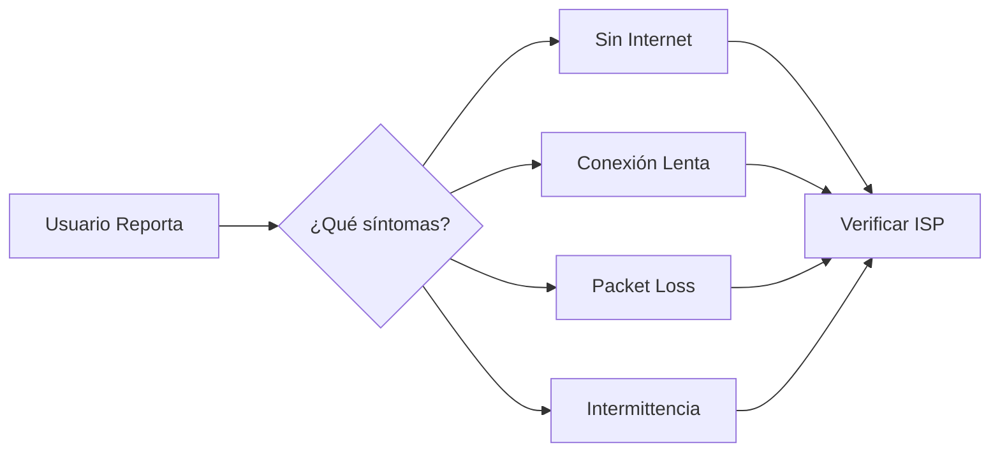

# Troubleshooting: Fallo de Enlace WAN

## 🔍 Descripción del Problema

Pérdida total o intermitente de conectividad en el enlace WAN principal, afectando la comunicación con sucursales, servicios en la nube o Internet.

## 🎯 Impacto Potencial

- **Crítico**: Todas las sucursales incomunicadas
- **Alto**: Servicios cloud inaccesibles
- **Medio**: Degradación de performance en aplicaciones distribuidas

## 📋 Síntomas Comunes



## 🔧 Procedimiento de Diagnóstico

### Paso 1: Verificar Estado del ISP

```bash
# Verificar estado del circuito con el ISP
# Llamar al NOC del proveedor o revisar portal de cliente

# Información necesaria para el ISP:
- Número de circuito/circuito ID: _______________
- Ubicación: _______________
- Tipo de servicio: (MPLS, Internet, Dedicated) _______________
```

**Checklist:**
- [ ] Contactar ISP para verificar estado del servicio
- [ ] Revisar portal de monitoreo del ISP (si disponible)
- [ ] Verificar si hay mantenimiento programado
- [ ] Confirmar si hay outage reportado en la zona

---

### Paso 2: Revisar Interfaz Serial/Física

```bash
# En router Cisco - Verificar estado de interfaces WAN
show interfaces serial 0/0/0
show interfaces gigabitEthernet 0/0

# Puntos clave a verificar:
# - Line protocol: up/down
# - Input/Output errors
# - Collisions
# - CRC errors
```

**Comandos de diagnóstico:**

```bash
# Verificar estadísticas de errores
show interfaces <INTERFACE> | include errors|drops|overruns

# Verificar nivel de señal (si aplica)
show controllers serial 0/0/0

# Verificar logs de la interfaz
show logging | include <INTERFACE>|Serial|GigabitEthernet
```

**Posibles hallazgos y acciones:**

| Síntoma | Causa Probable | Acción |
|---------|---------------|--------|
| Interface down/administratively down | Configuración | `no shutdown` |
| Line protocol down | Problema físico/ISP | Contactar ISP |
| High input errors | Cable/conector defectuoso | Reemplazar cable |
| CRC errors | Interferencia/cable dañado | Verificar cableado |
| Overruns | Buffer overflow | Revisar QoS/CPU |

---

### Paso 3: Verificar Túnel IPsec/GRE

```bash
# Verificar estado de túneles VPN
show crypto isakmp sa
show crypto ipsec sa
show crypto engine connections active

# Para túneles GRE
show interfaces tunnel <ID>
show ip interface brief | include Tunnel
```

**Diagnóstico de túnel:**

```bash
# Verificar que el túnel esté up/up
show interfaces tunnel <ID> | include line protocol

# Verificar routing a través del túnel
show ip route <REMOTE_NETWORK>

# Probar conectividad a través del túnel
ping <REMOTE_IP> source <LOCAL_TUNNEL_IP>
```

**Reiniciar túnel IPsec (si es necesario):**

```bash
# Limpiar SA de IKE
clear crypto isakmp

# Limpiar SA de IPsec
clear crypto ipsec sa

# Forzar renegociación
crypto map <MAP_NAME> <SEQ> set peer <PEER_IP>
```

---

### Paso 4: Análisis de Routing

```bash
# Verificar tabla de routing
show ip route
show ip route static
show ip route bgp        # Si usa BGP
show ip route ospf       # Si usa OSPF

# Verificar vecinos de routing
show ip ospf neighbor
show ip bgp summary

# Verificar ruta específica hacia destino crítico
traceroute <DESTINO_CRITICO>
```

**Problemas comunes de routing:**

| Problema | Síntoma | Solución |
|----------|---------|----------|
| Ruta faltante | Tráfico no llega | Agregar ruta estática |
| Vecino caído | OSPF/BGP down | Verificar conectividad L3 |
| Métrica incorrecta | Tráfico por camino subóptimo | Ajustar métricas |
| Route flapping | Inestabilidad | Investigar causa raíz |

---

### Paso 5: Pruebas de Conectividad

```bash
# Ping extendido para análisis detallado
ping
Protocol [ip]: 
Target IP address: <DESTINO>
Repeat count [5]: 100
Datagram size [100]: 1500
Timeout in seconds [2]: 
Extended commands [n]: y
Source address: <IP_LOCAL>

# Test de throughput (si hay herramienta disponible)
iperf3 -c <SERVIDOR_REMOTO> -t 30
```

**Análisis de resultados:**

```bash
# Calcular packet loss
# Packet loss > 1% = Problema significativo
# Latencia > 150ms = Posible congestión

# Ejemplo de interpretación:
# Success rate is 85 percent (85/100), round-trip min/avg/max = 45/67/234 ms
# → 15% packet loss, latencia variable = POSIBLE CONGESTIÓN O INTERFERENCIA
```

---

## 🛠️ Acciones Correctivas

### Escenario A: Falla Física Confirmada

```
1. Documentar hora exacta de caída
2. Contactar ISP inmediatamente (crear ticket)
3. Notificar a stakeholders del impacto
4. Activar enlace de backup (si disponible)
5. Monitorear restauración
6. Documentar tiempo de resolución
7. Realizar post-mortem
```

### Escenario B: Problema de Configuración

```
1. Identificar cambio reciente (who, what, when)
2. Revertir configuración al último estado conocido bueno
3. Verificar restauración del servicio
4. Documentar causa raíz
5. Actualizar procedimiento de cambio para prevenir recurrencia
```

### Escenario C: Congestión de Enlace

```
1. Identificar tráfico dominante
   show policy-map interface <INTERFACE>
   
2. Implementar/temporalmente ajustar QoS
   policy-map WAN-QOS
    class VOICE
     priority percent 20
    class CRITICAL
     bandwidth percent 40
   
3. Considerar upgrade de ancho de banda
4. Programar revisión de capacidad
```

---

## 📊 Matriz de Escalamiento

| Nivel | Tiempo sin respuesta | Contacto | Acción |
|-------|---------------------|----------|--------|
| 1 | 0-15 min | Network Admin | Diagnóstico inicial |
| 2 | 15-30 min | Network Senior + ISP | Escalar a ISP |
| 3 | 30-60 min | IT Manager | Notificar gerencia |
| 4 | >60 min | Executive Team | Activar plan de contingencia |

---

## 📝 Plantilla de Documentación de Incidente

```
INCIDENTE: Falla de Enlace WAN
FECHA/HORA: _______________
DURACIÓN: _______________
IMPACTO: _______________

CAUSA RAÍZ:
[ ] Falla ISP
[ ] Equipo local
[ ] Configuración
[ ] Otro: _________

ACCIONES TOMADAS:
1. _______________
2. _______________
3. _______________

TICKET ISP: _______________
TIEMPO DE RESOLUCIÓN: _______________

LECCIONES APRENDIDAS:
_________________________________
_________________________________

PREVENCIÓN FUTURA:
_________________________________
_________________________________
```

---

## 🔗 Referencias Rápidas

- **NOC ISP:** [Número de teléfono]
- **Ticket Portal:** [URL del portal]
- **Enlace de Backup:** [Procedimiento de activación]
- **Lista de Stakeholders:** [Contactos críticos]

---

**Última actualización:** $(date +%Y-%m-%d)  
**Autor:** Equipo de Redes  
**Versión:** 1.0
