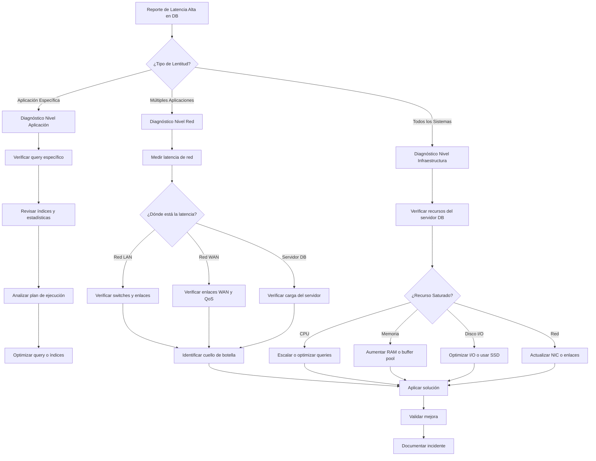

# Latencia Alta en Base de Datos - Guía de Diagnóstico

## 📋 Propósito

Proporcionar una guía estructurada para diagnosticar y resolver problemas de latencia alta en el acceso a la base de datos del Banco Tecnológico. Este documento sigue el formato "Si ocurre A, haz B" para facilitar la resolución rápida.

## 🎯 Alcance

- Latencia en aplicaciones que acceden a base de datos
- Lentitud en transacciones bancarias
- Timeouts en consultas críticas
- Problemas de rendimiento en sistemas core bancarios

## 📊 Umbrales Operativos

| Métrica | Normal | Advertencia | Crítico |
|---------|--------|-------------|---------|
| Latencia LAN | < 5 ms | 5-10 ms | > 10 ms |
| Latencia WAN | < 30 ms | 30-50 ms | > 50 ms |
| Latencia DB (query) | < 100 ms | 100-500 ms | > 500 ms |
| Pérdida de paquetes | 0% | < 1% | > 1% |
| Jitter | < 2 ms | 2-5 ms | > 5 ms |

## 🔍 Árbol de Decisión



## 🔬 Procedimiento de Diagnóstico Paso a Paso

### Paso 1: Mediciones Iniciales

#### Desde el Servidor de Aplicaciones

```bash
# Medir latencia hacia el servidor de base de datos
ping -c 20 <ip-servidor-db>

# Resultados esperados:
# - LAN: < 5ms
# - WAN: < 30ms

# Verificar pérdida de paquetes
# Cualquier pérdida > 0% es preocupante para DB
```

#### Traceroute para Identificar Saltos Problemáticos

```bash
# Identificar en qué salto se introduce latencia
traceroute -n <ip-servidor-db>

# Analizar cada salto:
# - Salto con > 10ms adicional → Punto de congestión
# - Timeout en salto intermedio → Posible problema de routing
```

#### Medición Directa de Conexión DB

```bash
# Para Oracle
sqlplus usuario/password@//host:port/service_name
SELECT SYSDATE FROM DUAL;
-- Medir tiempo de respuesta

# Para SQL Server
sqlcmd -S <server> -U usuario -P password -Q "SELECT GETDATE()"
-- Medir tiempo de respuesta

# Para MySQL/PostgreSQL
mysql -h <host> -u usuario -p -e "SELECT NOW();"
time mysql -h <host> -u usuario -p -e "SELECT NOW();"
```

---

### Paso 2: Descartar Cuellos de Botella en Red

#### Verificar Estado de Interfaces

```bash
# En switches intermedios
show interfaces counters errors
show interfaces <interface> status
show interfaces <interface> utilization

# Buscar:
# - Errores CRC → Problema de cableado
# - Collisions → Problema de duplex
# - Utilización > 80% → Enlace saturado
```

#### Verificar QoS (Calidad de Servicio)

```bash
# En routers WAN
show policy-map interface <interface>
show queueing interface <interface>

# Verificar que tráfico de DB tenga prioridad
# Clase de voz y DB deben tener cola prioritaria
```

#### Captura de Tráfico para Análisis

```bash
# En servidor de aplicaciones (tcpdump)
tcpdump -i any host <ip-db> and port 1521 -w db_traffic.pcap

# Analizar con Wireshark:
# - Retransmisiones TCP → Problema de red
# - Ventana TCP pequeña → Problema de buffering
# - RTT alto → Latencia de red real
```

---

### Paso 3: Verificar Servidor de Base de Datos

#### Métricas de Recursos

```bash
# CPU
top -bn1 | head -20
vmstat 1 5

# Si CPU > 80%:
# - Identificar procesos consumidores
# - Verificar queries en ejecución
```

```bash
# Memoria
free -h
cat /proc/meminfo | grep -E "MemTotal|MemFree|Buffers|Cached"

# Si memoria libre < 10%:
# - Verificar buffer pool de DB
# - Revisar swap usage (debe ser 0 o mínimo)
```

```bash
# I/O de Disco
iostat -x 1 5
iotop -o

# Si %util > 80% en discos de DB:
# - Identificar queries con mucho I/O
# - Considerar mover a SSD
# - Verificar fragmentación de índices
```

#### Consultas Activas en Base de Datos

```sql
-- Oracle: Queries más lentas actualmente
SELECT sid, serial#, username, sql_id, elapsed_time, cpu_time
FROM v$session s, v$sql q
WHERE s.sql_id = q.sql_id
AND status = 'ACTIVE'
ORDER BY elapsed_time DESC;

-- SQL Server: Queries con mayor tiempo de espera
SELECT 
    session_id,
    wait_type,
    wait_time_ms,
    blocking_session_id
FROM sys.dm_exec_requests
WHERE wait_type IS NOT NULL
ORDER BY wait_time_ms DESC;

-- MySQL: Processlist
SHOW FULL PROCESSLIST;
SHOW ENGINE INNODB STATUS;
```

---

### Paso 4: Identificar Queries Problemáticos

#### Queries Más Lentas (Histórico)

```sql
-- Oracle: Top 10 queries por tiempo total
SELECT * FROM (
    SELECT sql_id, executions, elapsed_time/1000000 as elapsed_sec,
           buffer_gets, disk_reads
    FROM v$sql
    WHERE executions > 0
    ORDER BY elapsed_time DESC
) WHERE ROWNUM <= 10;

-- SQL Server: Query Store (si está habilitado)
SELECT TOP 10 qsqt.query_sql_text, qrs.avg_duration
FROM sys.query_store_query_text qsqt
JOIN sys.query_store_query qsq ON qsqt.query_text_id = qsq.query_text_id
JOIN sys.query_store_runtime_stats qrs ON qsq.query_id = qrs.query_id
ORDER BY qrs.avg_duration DESC;

-- MySQL: Slow query log
-- Revisar archivo definido en slow_query_log_file
-- O consultar:
SHOW VARIABLES LIKE 'slow_query_log_file';
```

#### Analizar Plan de Ejecución

```sql
-- Oracle
EXPLAIN PLAN FOR <tu_query>;
SELECT * FROM TABLE(DBMS_XPLAN.DISPLAY);

-- SQL Server
SET STATISTICS PROFILE ON;
<tu_query>
SET STATISTICS PROFILE OFF;

-- MySQL
EXPLAIN FORMAT=JSON <tu_query>;
```

**Señales de Problema en el Plan:**

| Síntoma | Causa Probable | Solución |
|---------|---------------|----------|
| Full Table Scan | Falta índice | Crear índice en columnas del WHERE |
| Index Scan en vez de Seek | Índice no selectivo | Mejorar índice o estadísticas |
| Nested Loops con muchas filas | Cardinalidad mal estimada | Actualizar estadísticas |
| Sort/Hash Join en disco | Memoria insuficiente | Aumentar PGA/SGA o buffer pool |

---

### Paso 5: Verificar Infraestructura Subyacente

#### Virtualización (si aplica)

```bash
# En hypervisor (vSphere/ESXi)
esxtop

# Métricas clave:
# - CPU Ready > 10% → Contención de CPU
# - BALLOON > 0 → Presión de memoria
# - CMD/s alto → Contención de almacenamiento
```

#### Almacenamiento

```bash
# Latencia de disco
iostat -x 1 3

# Latencia > 10ms en almacenamiento de DB es problemático
# Latencia > 20ms requiere acción inmediata
```

#### Red Física

```bash
# Verificar errores en interfaces físicas
show interfaces <interface> counters detailed

# Buscar:
# - Input/Output errors
# - CRC errors
# - Runts/Giants
# Cualquier error creciente indica problema físico
```

---

## 🛠️ Soluciones Comunes

### Problema: Queries sin Índices Apropiados

**Síntomas:**
- Full table scans en queries frecuentes
- CPU alta en servidor de DB
- I/O excesivo

**Solución:**
```sql
-- Identificar tablas sin índices en queries lentos
-- Crear índice basado en columnas del WHERE/JOIN

CREATE INDEX idx_nombre_tabla_columna 
ON nombre_tabla(columna1, columna2)
TABLESPACE indices_ts;

-- Verificar que el índice se usa
EXPLAIN PLAN FOR <query>;
```

---

### Problema: Estadísticas Desactualizadas

**Síntomas:**
- Plan de ejecución subóptimo
- Query que antes era rápido ahora es lento
- Cambios recientes en distribución de datos

**Solución:**
```sql
-- Oracle
EXEC DBMS_STATS.GATHER_TABLE_STATS('SCHEMA', 'TABLA');

-- SQL Server
UPDATE STATISTICS dbo.tabla WITH FULLSCAN;

-- MySQL
ANALYZE TABLE nombre_tabla;
```

---

### Problema: Contención de Recursos

**Síntomas:**
- Múltiples queries esperando locks
- Wait events de bloqueo
- Throughput bajo con CPU baja

**Solución:**
```sql
-- Identificar bloqueos (Oracle)
SELECT blocking_session, sid, serial#, wait_class, seconds_in_wait
FROM v$session
WHERE blocking_session IS NOT NULL OR sid IN (SELECT blocking_session FROM v$session);

-- SQL Server: Deadlocks
SELECT * FROM sys.dm_tran_locks WHERE request_status = 'WAIT';

-- Acciones:
-- 1. Identificar query causante
-- 2. Optimizar para reducir tiempo de lock
-- 3. Considerar NOLOCK si es lectura y la consistencia lo permite
-- 4. Revisar diseño de transacciones
```

---

### Problema: Buffer Pool Insuficiente

**Síntomas:**
- Alto I/O físico de lectura
- Buffer cache hit ratio < 90%
- Queries repetitivos leen disco constantemente

**Solución:**
```sql
-- Oracle: Verificar hit ratio
SELECT name, value 
FROM v$sysstat 
WHERE name IN ('db block gets', 'consistent gets', 'physical reads');

-- Hit Ratio = (gets - physical_reads) / gets * 100
-- Debe ser > 90%

-- Aumentar buffer cache (si hay memoria disponible)
ALTER SYSTEM SET db_cache_size = 4G SCOPE=BOTH;

-- SQL Server: Buffer pool
SELECT 
    (cntr_value/1024)/1024 AS buffer_pool_mb
FROM sys.dm_os_performance_counters
WHERE counter_name = 'Total Pages'
AND object_name LIKE '%Buffer Manager%';
```

---

## 📈 Monitoreo Continuo

### Configurar Alertas Tempranas

```bash
# Script de monitoreo básico (ejecutar cada 5 min)
#!/bin/bash

DB_HOST="db-server.banco.local"
DB_PORT="1521"
UMBRAL_LATENCIA=50  # ms

LATENCIA=$(ping -c 4 $DB_HOST | grep rtt | cut -d'/' -f5 | cut -d'.' -f1)

if [ $LATENCIA -gt $UMBRAL_LATENCIA ]; then
    echo "ALERTA: Latencia alta hacia DB: ${LATENCIA}ms" | mail -s "ALERTA DB" team@banco.local
fi
```

### Dashboard Recomendado

Crear dashboard con las siguientes métricas:

1. **Latencia de Red** (tiempo real y histórico)
2. **Queries por Segundo**
3. **Tiempo Promedio de Respuesta**
4. **Wait Events Top 10**
5. **Utilización de Recursos** (CPU, Memoria, I/O)
6. **Espacio en Tablaspace**

---

## 📋 Checklist de Resolución

Durante el incidente:

- [ ] Medir latencia desde múltiples puntos
- [ ] Identificar si es problema de red o servidor
- [ ] Revisar queries activas
- [ ] Verificar recursos del servidor (CPU, RAM, I/O)
- [ ] Analizar planes de ejecución de queries lentos
- [ ] Implementar solución temporal si es crítico
- [ ] Documentar causa raíz

Después del incidente:

- [ ] Actualizar esta guía con lecciones aprendidas
- [ ] Implementar monitoreo preventivo
- [ ] Agendar revisión de capacidad si es necesario
- [ ] Capacitar equipo en síntomas identificados

---

## 🔗 Referencias

- Monitor de Enlaces: `/docs/scripts/monitor_enlaces.py`
- Troubleshooting de Conectividad: `/docs/troubleshooting/perdida-conectividad.md`
- Contactos de Emergencia: `/wiki/Contactos-y-Escalamiento.md`

---

**🏦 Banco Tecnológico - Departamento de TI**  
*Documento vivo - Actualizar después de cada incidente significativo*
