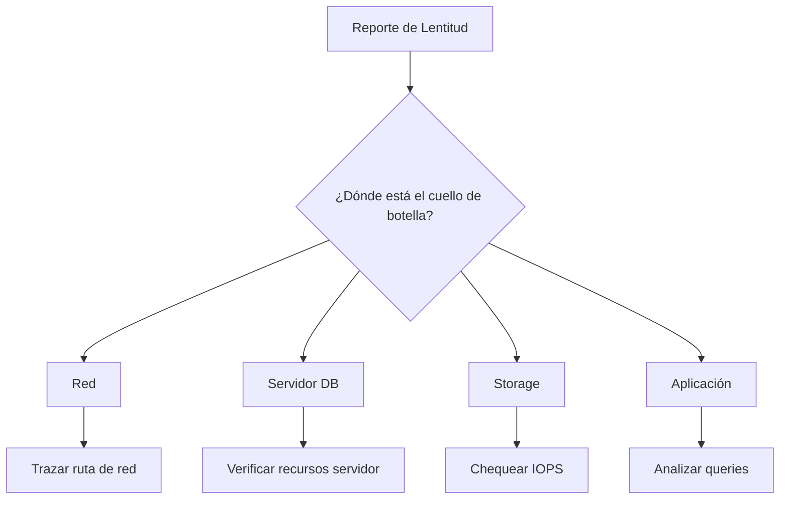

# Troubleshooting: Latencia en Base de Datos

## 🔍 Descripción del Problema

Alta latencia reportada en consultas a la base de datos, afectando el rendimiento de aplicaciones críticas y experiencia del usuario.

## 🎯 Impacto Potencial

- **Crítico**: Aplicaciones empresariales inoperables
- **Alto**: Timeouts en transacciones
- **Medio**: Degradación significativa de performance

## 📋 Síntomas Comunes



## 🔧 Procedimiento de Diagnóstico

### Paso 1: Identificar el Alcance del Problema

```bash
# Preguntas clave para el usuario/affected party:
# - ¿Qué aplicación específica está lenta?
# - ¿Desde cuándo ocurre?
# - ¿Afecta a todos los usuarios o solo algunos?
# - ¿Es constante o intermitente?
# - ¿Hay algún patrón (horario, tipo de consulta)?
```

**Checklist inicial:**
- [ ] Identificar servidores de base de datos involucrados
- [ ] Determinar si es problema generalizado o aislado
- [ ] Verificar si hay cambios recientes en infraestructura
- [ ] Revisar alertas de monitoreo existentes

---

### Paso 2: Trazar Ruta de Red (Network Path Analysis)

```bash
# Desde el servidor de aplicación hacia la base de datos
traceroute <DB_SERVER_IP>

# Con información de latencia por hop
mtr -rwc 100 <DB_SERVER_IP>

# Alternativa en Windows
tracert -d <DB_SERVER_IP>
```

**Análisis de traceroute:**

```bash
# Buscar:
# 1. Saltos con latencia inusual (>50ms entre saltos consecutivos)
# 2. Saltos que muestran packet loss (* * *)
# 3. Asimetría en rutas de ida y vuelta

# Ejemplo de interpretación:
# Hop 5: 192.168.10.1  45ms  48ms  234ms  ← LATENCIA VARIABLE (posible congestión)
# Hop 7: 10.0.0.1      *     *     *      ← PACKET LOSS (router no responde o caído)
```

**Comandos adicionales de diagnóstico de red:**

```bash
# Test continuo de conectividad
ping -i 0.2 <DB_SERVER_IP> | tee /tmp/ping_db.log

# Verificar MTU (problemas de fragmentación)
ping -M do -s 1472 <DB_SERVER_IP>  # Para MTU 1500
ping -M do -s 8972 <DB_SERVER_IP>  # Para jumbo frames MTU 9000

# Chequear estado de interfaces en ruta
ssh <INTERMEDIATE_ROUTER> "show interfaces | include errors|drops"
```

---

### Paso 3: Verificar Switch Central (Core Switch)

```bash
# En switch core Cisco - Verificar interfaz hacia DB server
show interfaces <INTERFACE_TO_DB> | include rate|errors|drops

# Verificar utilización de puertos
show interfaces summary

# Chequear cola de buffers
show queueing interface <INTERFACE>

# Verificar errores CRC (posible cable dañado)
show interfaces <INTERFACE> | include CRC
```

**Posibles hallazgos en switch:**

| Síntoma | Causa Probable | Acción Correctiva |
|---------|---------------|-------------------|
| Output drops | Congestión de puerto | Implementar QoS |
| Input errors | Cable/conector defectuoso | Reemplazar cable |
| Runts/Giants | Problema de MTU/duplex | Verificar configuración |
| High broadcast | Broadcast storm | Investigar origen |
| Buffer allocation failed | Insuficiente memoria | Upgrade hardware |

**Comandos de troubleshooting avanzado:**

```bash
# Capturar tráfico hacia DB server (SPAN/mirror)
monitor session 1 source interface <APP_SERVER_PORT> both
monitor session 1 destination interface <ANALYZER_PORT>

# Verificar spanning-tree (posible reconvergencia)
show spanning-tree detail | include occurred|change

# Chequear flapping de enlaces
show logging | include link|flap
```

---

### Paso 4: Analizar Recursos del Servidor de Base de Datos

```bash
# Conexión SSH al servidor de base de datos
ssh admin@<DB_SERVER>

# Verificar uso de CPU
top -bn1 | head -20
mpstat -P ALL 2 5

# Verificar memoria
free -h
vmstat 2 10

# Verificar I/O de disco
iostat -x 2 10
iotop -o

# Verificar conexiones de red activas
netstat -an | grep :<DB_PORT> | wc -l
ss -s
```

**Métricas clave a monitorear:**

| Recurso | Umbral Crítico | Acción |
|---------|---------------|--------|
| CPU | >90% sostenido | Identificar procesos |
| Memoria | >95% usada | Revisar buffer pool |
| Disk I/O Wait | >20% | Optimizar queries/storage |
| Network connections | Near limit | Ajustar max_connections |

---

### Paso 5: Identificar Queries Problemáticos

```sql
-- En MySQL/MariaDB
SELECT 
    id, user, host, db, command, time, state, info
FROM information_schema.processlist
WHERE time > 5
ORDER BY time DESC;

-- Queries más lentos (requiere slow query log)
SELECT * FROM mysql.slow_log 
ORDER BY start_time DESC LIMIT 10;

-- En PostgreSQL
SELECT pid, now() - pg_stat_activity.query_start AS duration, query, state
FROM pg_stat_activity
WHERE (now() - pg_stat_activity.query_start) > interval '5 minutes'
ORDER BY duration DESC;

-- En SQL Server
SELECT 
    session_id, start_time, status, command, wait_type, wait_time
FROM sys.dm_exec_requests
WHERE wait_time > 5000
ORDER BY wait_time DESC;
```

---

### Paso 6: Diagnosticar Problemas de Storage

```bash
# Verificar IOPS del storage
iostat -x 1 10

# Interpretación:
# %util接近100% = Storage saturado
# await alto (>10ms) = Latencia de disco elevada

# Verificar espacio disponible
df -h
df -i  # Inodos

# Chequear RAID status (si aplica)
cat /proc/mdstat
megacli -LDInfo -LAll -aAll  # LSI RAID

# Verificar latency de disco en tiempo real
pidstat -d 2 10
```

---

## 🛠️ Acciones Correctivas

### Escenario A: Congestión de Red

```
1. Identificar fuente de tráfico excesivo
   show policy-map interface <INTERFACE>
   
2. Implementar QoS para priorizar tráfico de DB
   class-map match-any DB_TRAFFIC
    match port tcp 1433    -- SQL Server
    match port tcp 3306    -- MySQL
    match port tcp 5432    -- PostgreSQL
   
   policy-map NETWORK-QOS
    class DB_TRAFFIC
     priority percent 30
   
3. Considerar segmentación de tráfico (VLAN separada)
4. Evaluar upgrade de ancho de banda
```

### Escenario B: Queries Ineficientes

```
1. Identificar query problemático (ver Paso 5)
2. Analizar execution plan
   EXPLAIN SELECT ...;
   
3. Acciones posibles:
   - Agregar índices faltantes
   - Reescribir query
   - Actualizar estadísticas de tablas
   - Considerar caching (Redis/Memcached)
   
4. Implementar query timeouts
5. Programar maintenance window para optimización
```

### Escenario C: Recursos Insuficientes

```
1. Documentar utilización actual
2. Proyectar crecimiento
3. Opciones:
   - Vertical scaling (más RAM/CPU)
   - Horizontal scaling (read replicas)
   - Migrar a storage más rápido (SSD/NVMe)
   
4. Implementar monitoring proactivo
```

---

## 📊 Matriz de Escalamiento

| Nivel | Síntoma | Contacto | SLA Respuesta |
|-------|---------|----------|---------------|
| 1 | Latencia >100ms | Network Admin | 15 min |
| 2 | Latencia >500ms + timeout | DBA + Network Senior | 30 min |
| 3 | Aplicación crítica down | IT Manager + Vendor | 1 hora |
| 4 | Múltiples sistemas afectados | Executive Team | Inmediato |

---

## 📝 Checklist de Verificación Rápida

```
RED:
[ ] Traceroute sin saltos problemáticos
[ ] Packet loss < 0.1%
[ ] Latencia consistente (<50ms variación)
[ ] Interfaces sin errores

SWITCH:
[ ] Utilización de puerto < 70%
[ ] Sin output drops
[ ] Spanning-tree estable
[ ] Buffers disponibles

SERVIDOR DB:
[ ] CPU < 80%
[ ] Memoria disponible > 10%
[ ] Disk I/O wait < 10%
[ ] Conexiones dentro del límite

STORAGE:
[ ] IOPS dentro de especificación
[ ] Latencia de disco < 10ms
[ ] Espacio disponible > 20%
[ ] RAID healthy

DATABASE:
[ ] No hay queries bloqueados
[ ] Lock wait timeout bajo control
[ ] Buffer pool hit ratio > 95%
[ ] Replication lag aceptable
```

---

## 🔗 Herramientas Recomendadas

| Herramienta | Propósito | Comando/Ejemplo |
|------------|-----------|-----------------|
| mtr | Análisis de ruta continuo | `mtr -rwc 100 <host>` |
| Wireshark | Captura y análisis de paquetes | GUI filter: `tcp.port == 3306` |
| pt-query-digest | Análisis de queries MySQL | `pt-query-digest slow.log` |
| pgBadger | Reportes PostgreSQL | `pgbadger -p '%t:%r:%u@%d:[%p]:' logfile` |
| iostat | Monitoreo de I/O | `iostat -x 2 10` |
| netdata | Dashboard en tiempo real | Web UI: http://server:19999 |

---

## 📄 Referencias

- [MySQL Performance Schema](https://dev.mysql.com/doc/)
- [PostgreSQL Monitoring](https://www.postgresql.org/docs/current/monitoring.html)
- [SQL Server DMVs](https://docs.microsoft.com/sql/relational-databases/system-dynamic-management-views/)
- [Cisco QoS Configuration Guide](link-a-doc)

---

**Última actualización:** $(date +%Y-%m-%d)  
**Autor:** Equipo de Redes + DBA  
**Versión:** 1.0  
**Próxima revisión:** Después del próximo incidente crítico
