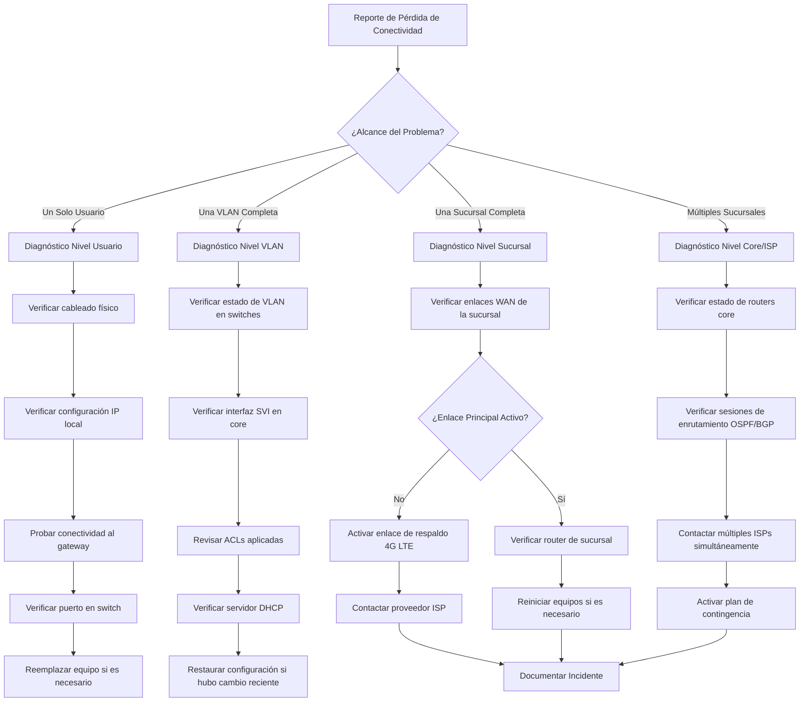
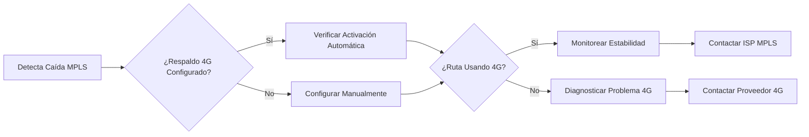

# Pérdida de Conectividad - Árbol de Diagnóstico

## 📋 Propósito

Proporcionar un árbol de decisión estructurado para diagnosticar y resolver problemas de pérdida de conectividad en la red del Banco Tecnológico. Este documento sigue el formato "Si ocurre A, haz B" para facilitar la resolución rápida de incidentes.

## 🎯 Alcance

- Problemas de conectividad en sucursales
- Caídas de enlace WAN
- Problemas de acceso a aplicaciones críticas
- Fallos de comunicación entre VLANs

## 🌳 Árbol de Decisión Principal



## 🔍 Diagnóstico por Nivel

### Nivel 1: Un Solo Usuario

#### Síntomas
- Un usuario reporta no tener conexión a red/internet
- Otros usuarios en la misma área funcionan normalmente

#### Pasos de Diagnóstico

**Paso 1: Verificar cableado físico**
```bash
# Preguntar al usuario
- ¿Las luces del puerto de red están encendidas?
- ¿El cable está bien conectado?
- ¿Hubo movimientos recientes del equipo?

# Si es posible verificar remotamente
show interfaces status | include <puerto>
```

**Paso 2: Verificar configuración IP local**
```bash
# En equipo del usuario (Windows)
ipconfig /all

# Verificar que tenga IP válida
# IP esperada: 10.10.XX.XX (según VLAN)
# Gateway: 10.10.XX.1

# Si tiene IP 169.254.x.x → Problema de DHCP
```

**Paso 3: Probar conectividad al gateway**
```bash
# Ping al gateway
ping 10.10.XX.1

# Si responde → Problema probablemente de DNS o aplicación
# Si no responde → Problema de capa 2/3
```

**Paso 4: Verificar puerto en switch**
```bash
# Conectar al switch de acceso
ssh admin@switch-acceso-<ubicacion>

# Verificar estado del puerto
show interfaces GigabitEthernet1/0/<puerto> status
show interfaces GigabitEthernet1/0/<puerto> counters errors

# Verificar VLAN asignada
show running-config interface GigabitEthernet1/0/<puerto>
```

**Posibles Soluciones:**

| Causa | Síntoma | Solución |
|-------|---------|----------|
| Cable dañado | Sin link | Reemplazar cable |
| Puerto deshabilitado | Port disabled | `no shutdown` en interfaz |
| VLAN incorrecta | Sin conectividad | Corregir `switchport access vlan` |
| Equipo defectuoso | Múltiples errores | Reemplazar NIC o equipo |

---

### Nivel 2: Una VLAN Completa

#### Síntomas
- Múltiples usuarios de la misma VLAN sin conectividad
- Usuarios de otras VLANs funcionan normalmente

#### Pasos de Diagnóstico

**Paso 1: Verificar estado de VLAN en switches**
```bash
# En switch core
show vlan id <ID_VLAN>

# Verificar que la VLAN exista y esté activa
# Verificar puertos miembros
```

**Paso 2: Verificar interfaz SVI en core**
```bash
# Verificar interfaz Layer 3 de la VLAN
show interface Vlan<ID_VLAN>
show ip interface brief | include Vlan<ID_VLAN>

# Debe estar: up/up con IP configurada
```

**Paso 3: Revisar ACLs aplicadas**
```bash
# Verificar ACLs en la interfaz SVI
show ip access-lists
show running-config interface Vlan<ID_VLAN>

# Buscar denegaciones recientes
show logging | include ACL.*DENY
```

**Paso 4: Verificar servidor DHCP**
```bash
# En servidor DHCP
# Verificar que el scope no esté lleno
# Verificar que el servicio esté corriendo

# En switch (si hay helper)
show running-config | include ip helper
```

**Posibles Soluciones:**

| Causa | Síntoma | Solución |
|-------|---------|----------|
| SVI caído | Interface down/admin down | `no shutdown` en SVI |
| ACL bloqueando | Denys en logs | Ajustar reglas de ACL |
| DHCP agotado | Usuarios sin IP | Expandir scope DHCP |
| VLAN eliminada | VLAN no existe | Restaurar configuración de VLAN |

---

### Nivel 3: Una Sucursal Completa

#### Síntomas
- Toda una sucursal reporta pérdida de conectividad
- No hay comunicación con datacenter central

#### Pasos de Diagnóstico

**Paso 1: Verificar enlaces WAN de la sucursal**
```bash
# Desde router core
show interfaces GigabitEthernet0/0  # Enlace principal MPLS
show interfaces GigabitEthernet0/1  # Enlace respaldo 4G

# Verificar estado de línea y protocolo
# Esperado: line protocol is up
```

**Paso 2: Verificar reachability**
```bash
# Hacer ping desde core hacia router de sucursal
ping 10.XX.XX.X source GigabitEthernet0/0

# Si no responde → Problema en enlace o router remoto
```

**Paso 3: Verificar enrutamiento**
```bash
# Verificar rutas hacia la sucursal
show ip route 10.XX.XX.X

# Verificar vecinos OSPF
show ip ospf neighbor

# El router de sucursal debe aparecer como FULL
```

**Paso 4: Activar enlace de respaldo (si aplica)**
```bash
# Si el enlace principal está caído
# Verificar que el 4G LTE esté activo

show interfaces GigabitEthernet0/1
show ip route 0.0.0.0  # Debe usar ruta flotante

# Si no se activó automáticamente
interface GigabitEthernet0/0
 shutdown  # Forzar failover
```

**Paso 5: Contactar proveedor ISP**
```bash
# Tener lista la información:
- ID de circuito: MPLS-XXXX
- Ubicación: Sucursal XXXX
- Hora de inicio del incidente
- Pruebas realizadas
```

**Flujo de Activación de Respaldo 4G:**



**Posibles Soluciones:**

| Causa | Síntoma | Solución |
|-------|---------|----------|
| Corte de fibra | Interface down | Activar 4G, contactar ISP |
| Router sucursal caído | Sin respuesta ping | Reiniciar remotamente o enviar técnico |
| Configuración incorrecta | Ruta no aparece | Restaurar config desde backup |
| Problema ISP | Múltiples clientes afectados | Ticket urgente al proveedor |

---

### Nivel 4: Múltiples Sucursales / Core

#### Síntomas
- Varias sucursales reportan problemas simultáneamente
- Posible problema en datacenter o ISP principal

#### Pasos de Diagnóstico

**Paso 1: Verificar estado de routers core**
```bash
# Verificar salud general del core
show processes cpu sorted
show memory statistics
show environment all

# CPU > 80% o memoria baja → Investigar causa
```

**Paso 2: Verificar sesiones de enrutamiento**
```bash
# OSPF
show ip ospf neighbor
# Todos los vecinos deben estar en FULL

# BGP (si aplica)
show ip bgp summary
# Estado debe ser Established
```

**Paso 3: Verificar conectividad hacia ISPs**
```bash
# Ping hacia next-hop de cada ISP
ping 200.10.50.2  # ISP Principal
ping 198.51.100.2  # ISP Secundario

# Traceroute para identificar punto de falla
traceroute 8.8.8.8
```

**Paso 4: Contactar múltiples ISPs**
```bash
# Si ambos enlaces están afectados
# Contactar ISP Principal:
- Teléfono: XXXX-XXXX
- ID Circuito: MPLS-CORE-001

# Contactar ISP Secundario:
- Teléfono: YYYY-YYYY
- ID Circuito: 4G-CORE-001
```

**Posibles Soluciones:**

| Causa | Síntoma | Solución |
|-------|---------|----------|
| Router core saturado | CPU/Memoria alta | Identificar proceso, reiniciar si necesario |
| Sesiones OSPF inestables | Flapping neighbors | Verificar enlaces, timers |
| Problema ISP principal | Solo un enlace afectado | Usar secundario, abrir ticket |
| Ataque DDoS | Tráfico anómalo | Activar mitigación, contactar ISP |

---

## 📞 Matriz de Escalamiento

| Nivel | Tiempo Máx. | Responsable | Contacto |
|-------|-------------|-------------|----------|
| 1 - Usuario | 30 min | Help Desk | ext. 1000 |
| 2 - VLAN | 15 min | Admin Red Junior | ext. 1001 |
| 3 - Sucursal | 10 min | Admin Red Senior | ext. 1002 |
| 4 - Core/Múltiple | 5 min | Gerente TI + Proveedores | ext. 1003 / Celular |

## 📋 Checklist de Documentación Post-Incidente

Después de resolver el incidente:

- [ ] Registrar hora de inicio y fin
- [ ] Documentar causa raíz
- [ ] Listar acciones tomadas
- [ ] Identificar lecciones aprendidas
- [ ] Actualizar procedimientos si es necesario
- [ ] Notificar a stakeholders
- [ ] Cerrar ticket con evidencia

## 🔗 Referencias

- Procedimiento de Respaldo: `/docs/procedimientos/respaldo-configuraciones.md`
- Contactos de Emergencia: `/wiki/Contactos-y-Escalamiento.md`
- Bitácora de Incidentes: `/incidentes/`

---

**🏦 Banco Tecnológico - Departamento de TI**  
*Documento vivo - Actualizar después de cada incidente significativo*
