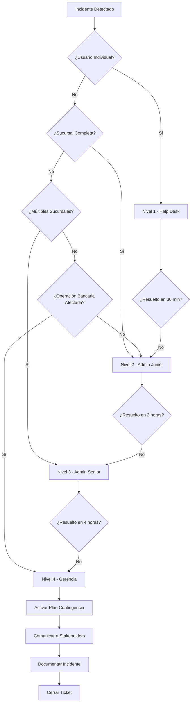

# 📞 Contactos y Matriz de Escalamiento

## Propósito

Este documento proporciona la matriz de escalamiento por niveles, contactos internos, datos de proveedores e IDs de circuito para incidentes de red del Banco Tecnológico.

---

## 🔴 Matriz de Escalamiento por Niveles

### Nivel 1 - Help Desk (0-30 minutos)

| Rol | Responsable | Contacto | Disponibilidad |
|-----|-------------|----------|----------------|
| Help Desk | Turno Rotativo | ext. 1000 | 24/7 |
| | | helpdesk@banco.local | |
| Ticket System | ServiceNow | [portal.banco.local](http://portal.banco.local) | 24/7 |

**Alcance:**
- Incidentes de usuario individual
- Problemas de conectividad básica
- Primer nivel de diagnóstico

---

### Nivel 2 - Admin Red Junior (30 minutos - 2 horas)

| Rol | Responsable | Contacto | Disponibilidad |
|-----|-------------|----------|----------------|
| Admin Red 1 | Juan Pérez | ext. 1001 | Lunes-Viernes 8AM-6PM |
| | | juan.perez@banco.local | |
| Admin Red 2 | María González | ext. 1002 | Lunes-Viernes 8AM-6PM |
| | | maria.gonzalez@banco.local | |
| On-Call | Guardia Semanal | +502-5555-0101 | Fuera de horario |

**Alcance:**
- Incidentes de VLAN completa
- Problemas de sucursal individual
- Cambios de baja complejidad

---

### Nivel 3 - Admin Red Senior (2-4 horas)

| Rol | Responsable | Contacto | Disponibilidad |
|-----|-------------|----------|----------------|
| Senior Admin 1 | Carlos Ramírez | ext. 1003 | 24/7 bajo demanda |
| | | carlos.ramirez@banco.local | |
| | | +502-5555-0103 (celular) | |
| Senior Admin 2 | Ana López | ext. 1004 | 24/7 bajo demanda |
| | | ana.lopez@banco.local | |
| | | +502-5555-0104 (celular) | |

**Alcance:**
- Incidentes críticos de sucursales múltiples
- Caídas de enlace WAN principal
- Cambios de media/alta complejidad
- Aprobación de cambios en producción

---

### Nivel 4 - Gerencia y Proveedores (4+ horas)

| Rol | Responsable | Contacto | Disponibilidad |
|-----|-------------|----------|----------------|
| Gerente TI | Roberto Díaz | ext. 1010 | 24/7 |
| | | roberto.diaz@banco.local | |
| | | +502-5555-0110 (celular) | |
| Director Operaciones | Luisa Fernández | ext. 1020 | 24/7 |
| | | luisa.fernandez@banco.local | |
| | | +502-5555-0120 (celular) | |

**Alcance:**
- Incidentes que afectan operaciones bancarias
- Decisiones de negocio críticas
- Autorización de planes de contingencia
- Comunicación con reguladores

---

## 🌐 Proveedores de Servicios WAN

### ISP Principal - Telefónica Empresarial

| Concepto | Detalle |
|----------|---------|
| **Tipo de Servicio** | MPLS IP-VPN |
| **Ancho de Banda** | 100 Mbps simétricos |
| **ID Circuito Principal** | MPLS-GT-001234 |
| **ID Circuito Respaldo** | MPLS-GT-001235 |
| **Soporte Técnico** | 1800-TELEFONICA |
| **Soporte Empresarial** | +502-2290-0000 |
| **Email Soporte** | soporte.empresarial@telefonica.com |
| **Portal Cliente** | [miempresa.telefonica.com](https://miempresa.telefonica.com) |
| **Account Manager** | Pedro Sánchez |
| **Contacto AM** | pedro.sanchez@telefonica.com / +502-5555-0201 |
| **SLA Garantizado** | 99.9% disponibilidad |
| **Tiempo Respuesta** | 4 horas para fallas críticas |

---

### ISP Secundario - Claro Empresas (Respaldo 4G LTE)

| Concepto | Detalle |
|----------|---------|
| **Tipo de Servicio** | 4G LTE Fijo |
| **Ancho de Banda** | 50 Mbps down / 10 Mbps up |
| **ID Circuito** | 4G-BANCO-5678 |
| **Soporte Técnico** | *611 desde móvil Claro |
| **Soporte Empresarial** | +502-2424-5000 |
| **Email Soporte** | empresas.soporte@claro.com.gt |
| **Portal Cliente** | [empresas.claro.com.gt](https://empresas.claro.com.gt) |
| **Account Manager** | Sofía Morales |
| **Contacto AM** | sofia.morales@claro.com.gt / +502-5555-0301 |
| **SLA Garantizado** | 99.5% disponibilidad |
| **Tiempo Respuesta** | 8 horas para fallas críticas |

---

### ISP Internet Directo - Tigo Business

| Concepto | Detalle |
|----------|---------|
| **Tipo de Servicio** | Fibra Óptica Dedicada |
| **Ancho de Banda** | 200 Mbps simétricos |
| **ID Circuito** | TIGO-FIBRA-9012 |
| **Soporte Técnico** | 1717 |
| **Soporte Empresarial** | +502-2290-7000 |
| **Email Soporte** | business.soporte@tigo.com.gt |
| **Portal Cliente** | [business.tigo.com.gt](https://business.tigo.com.gt) |
| **Account Manager** | Luis Hernández |
| **Contacto AM** | luis.hernandez@tigo.com.gt / +502-5555-0401 |
| **SLA Garantizado** | 99.95% disponibilidad |
| **Tiempo Respuesta** | 2 horas para fallas críticas |

---

## 🏢 Sucursales - Contactos Locales

### Matriz Central

| Rol | Nombre | Contacto |
|-----|--------|----------|
| Gerente de Sucursal | Patricia Gómez | ext. 2001 / +502-5555-1001 |
| Supervisor Operaciones | Ricardo Mendoza | ext. 2002 / +502-5555-1002 |
| Enlace TI Local | Diego Torres | ext. 2003 / +502-5555-1003 |

---

### Sucursal Mixco

| Rol | Nombre | Contacto |
|-----|--------|----------|
| Gerente de Sucursal | Carmen Ruiz | ext. 2101 / +502-5555-1101 |
| Supervisor Operaciones | Jorge Castillo | ext. 2102 / +502-5555-1102 |
| Enlace TI Local | Andrea Vargas | ext. 2103 / +502-5555-1103 |

**IDs de Circuito:**
- MPLS: `MPLS-MIXCO-001`
- 4G Respaldo: `4G-MIXCO-001`

---

### Sucursal Zona 10

| Rol | Nombre | Contacto |
|-----|--------|----------|
| Gerente de Sucursal | Fernando Ortiz | ext. 2201 / +502-5555-1201 |
| Supervisor Operaciones | Mónica Delgado | ext. 2202 / +502-5555-1202 |
| Enlace TI Local | Pablo Jiménez | ext. 2203 / +502-5555-1203 |

**IDs de Circuito:**
- MPLS: `MPLS-ZONA10-001`
- 4G Respaldo: `4G-ZONA10-001`

---

## 🔧 Proveedores de Equipamiento

### Cisco Systems

| Concepto | Detalle |
|----------|---------|
| **Soporte Técnico** | 0800-CISCO-GT |
| **SMARTnet Contract** | CISCO-SMART-12345 |
| **Nivel de Soporte** | 24x7x4 (respuesta en 4 horas) |
| **Portal TAC** | [my.cisco.com](https://my.cisco.com) |
| **Email TAC** | tac@cisco.com |
| **Account Team** | Gustavo Rivera / gustavo.rivera@cisco.com |

---

### Palo Alto Networks (Firewalls)

| Concepto | Detalle |
|----------|---------|
| **Soporte Técnico** | +1-408-753-4000 (Global) |
| **Support Contract** | PAN-SUPPORT-67890 |
| **Nivel de Soporte** | Premium 24x7 |
| **Portal Support** | [support.paloaltonetworks.com](https://support.paloaltonetworks.com) |
| **Email Support** | support@paloaltonetworks.com |
| **SE Asignado** | Michelle Wong / mwong@paloaltonetworks.com |

---

## 📊 Proceso de Escalamiento



---

## 🕐 Tiempos Máximos de Respuesta por Severidad

| Severidad | Descripción | Tiempo Respuesta | Tiempo Resolución | Escalar a |
|-----------|-------------|------------------|-------------------|-----------|
| 🔴 Crítica | Servicio bancario caído | Inmediato | < 1 hora | Nivel 4 |
| 🟠 Alta | Degradación significativa | < 15 min | < 2 horas | Nivel 3 |
| 🟡 Media | Impacto limitado | < 1 hora | < 4 horas | Nivel 2 |
| 🟢 Baja | Sin impacto operacional | < 4 horas | < 24 horas | Nivel 1 |

---

## 📝 Plantilla de Comunicación de Incidentes

### Para Gerencia (Nivel 4)

```
ASUNTO: [CRÍTICO/ALTO] Breve descripción del incidente

ESTADO ACTUAL:
- Hora de inicio: HH:MM
- Sistemas afectados: XXX
- Sucursales impactadas: XXX
- Usuarios estimados: XXX

ACCIONES TOMADAS:
1. Acción 1
2. Acción 2

PRÓXIMOS PASOS:
- Paso 1 (ETA: HH:MM)
- Paso 2 (ETA: HH:MM)

IMPACTO DE NEGOCIO:
- Descripción del impacto operacional

PRÓXIMA ACTUALIZACIÓN: HH:MM

Contacto: Nombre / Teléfono
```

---

## 🔗 Referencias

- Home Wiki: `/wiki/Home.md`
- Procedimientos: `/docs/procedimientos/`
- Troubleshooting: `/docs/troubleshooting/`
- Bitácora Incidentes: `/incidentes/`

---

**🏦 Banco Tecnológico - Departamento de TI**  
*Última actualización: 2024-01-15*  
*Versión: 1.0*  
*Documento confidencial - Solo uso interno*
