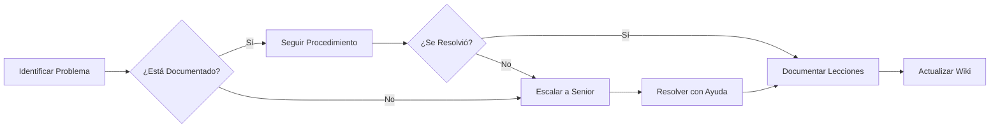
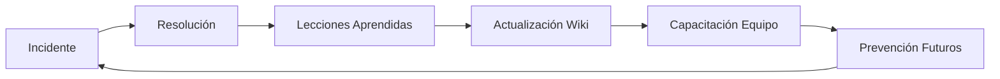

# 🏦 Wiki - Sistema de Gestión del Conocimiento

## Bienvenido al Sistema KM del Banco Tecnológico

Este es el punto de entrada central para toda la documentación técnica del Departamento de TI del Banco Tecnológico.

---

## 🚀 Accesos Rápidos

### Para Nuevo Personal (Onboarding)

1. **Primera Semana:**
   - [ ] Leer [Glosario de Términos](./Glosario.md)
   - [ ] Revisar [Contactos y Escalamiento](./Contactos-y-Escalamiento.md)
   - [ ] Configurar accesos a sistemas
   - [ ] Shadowing con miembro senior

2. **Primer Mes:**
   - [ ] Completar capacitación en procedimientos básicos
   - [ ] Practicar en ambiente de laboratorio
   - [ ] Participar en al menos 2 cambios supervisados

3. **Primeros 90 Días:**
   - [ ] Certificación en procedimientos críticos
   - [ ] Capacidad de responder incidentes Nivel 2
   - [ ] Contribuir con mejora a documentación

---

## 📚 Estructura de Documentación

```
📦 Repositorio KM
├── 📖 Wiki (este directorio)
│   ├── Home.md (esta página)
│   ├── Glosario.md
│   └── Contactos-y-Escalamiento.md
│
├── 📋 Procedimientos (/docs/procedimientos/)
│   ├── Configuración Router Core
│   ├── Respaldo de Configuraciones
│   └── Gestión de VLANs
│
├── 🛠️ Scripts (/docs/scripts/)
│   ├── backup_configs.sh
│   └── monitor_enlaces.py
│
├── 🔧 Troubleshooting (/docs/troubleshooting/)
│   ├── Pérdida de Conectividad
│   └── Latencia Alta en DB
│
└── 📊 Incidentes (/incidentes/)
    ├── INC-001 - Caída MPLS Mixco
    └── INC-002 - Saturación Firewall
```

---

## 🎯 ¿Cómo Usar Este Sistema?

### Buscar Información

1. **Usar la búsqueda de GitHub** (recomendado)
2. **Navegar por la estructura de carpetas**
3. **Consultar el índice en README.md**

### Reportar un Problema



### Contribuir Mejoras

1. Identificar área de mejora en documentación
2. Crear branch feature desde main
3. Editar archivo Markdown correspondiente
4. Crear Pull Request con descripción de cambios
5. Esperar revisión de par (obligatorio)
6. Merge después de aprobación

---

## 📊 Estado Actual del Sistema

| Componente | Estado | Última Actualización |
|------------|--------|---------------------|
| Procedimientos Críticos | ✅ Completo | 2024-01-15 |
| Scripts de Automatización | ✅ Completo | 2024-01-15 |
| Guías de Troubleshooting | ✅ Completo | 2024-01-15 |
| Wiki Interna | ✅ Completo | 2024-01-15 |
| Bitácora de Incidentes | 🔄 En Progreso | 2024-01-15 |

---

## 🔑 Convenciones Importantes

### Nomenclatura de Archivos

- **Minúsculas con guiones**: `nombre-archivo.md`
- **Prefijo para incidentes**: `INC-001-descripcion.md`
- **Fechas en ISO**: `YYYY-MM-DD`

### Niveles de Severidad

| Nivel | Color | Descripción | Tiempo Respuesta |
|-------|-------|-------------|------------------|
| Crítico | 🔴 | Servicio bancario afectado | Inmediato |
| Alto | 🟠 | Degradación significativa | < 15 min |
| Medio | 🟡 | Impacto limitado | < 1 hora |
| Bajo | 🟢 | Sin impacto operacional | < 24 horas |

### Formato de Comandos

Todos los comandos de consola están en bloques de código:

```bash
# Esto es un comando de ejemplo
show running-config

# Los comentarios empiezan con #
```

---

## 📞 ¿Necesitas Ayuda?

1. **Consulta la documentación** primero
2. **Pregunta en el canal** del equipo (#network-team)
3. **Escala según matriz** de escalamiento
4. **Documenta** lo aprendido

---

## 📈 Métricas del Sistema KM

El valor de este sistema se mide por:

- ✅ **Reducción del MTTR** (Mean Time To Resolution)
- ✅ **Menor dependencia** del personal senior
- ✅ **Mayor consistencia** en procedimientos
- ✅ **Mejor onboarding** de nuevo personal

**Meta 2024:** Reducir MTTR en 40% para incidentes documentados

---

## 🔄 Ciclo de Mejora Continua



---

**🏦 Banco Tecnológico - Departamento de TI**  
*Última actualización: 2024-01-15*  
*Versión del documento: 1.0*

---

## Enlaces Relacionados

- [README Principal](../README.md)
- [Procedimientos](../docs/procedimientos/)
- [Scripts](../docs/scripts/)
- [Troubleshooting](../docs/troubleshooting/)
- [Incidentes](../incidentes/)
